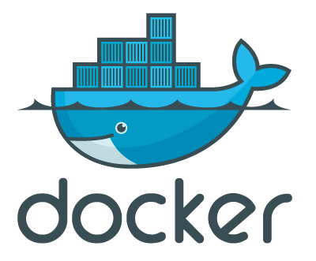

Эта статья описывает использование контейнеров docker как отдельные ноды для системы непрерывной интеграции, в данном случае jenkins. Кому лень читать [tl; dr](https://github.com/antigluk/docker-jenkins-slave) Для сборки нашего проекта в RPM и DEB пакеты мы используем Jenkins, на что выделена специальная машина.\

[{border="0" height="165" width="200"}](images/image-01.png){imageanchor="1" style="clear: right; float: right; margin-bottom: 1em; margin-left: 1em;"}

\
Сначала мы собирали наш проект только для CentOS 6. Далее добавилась поддержка CentOS 5, и оказалось что зависимости от конкретных версий библиотек не дают работать тем же бинарникам под разными версиями CentOS, понадобилась сборка разных RPM. Это было решено добавлением в jenkins ноды с CentOS 5, которой служила виртуалка на VirtualBox. Потом добавилась поддержка Suse, а потом и Debian.\
\
Количество оперативной памяти не резиновое, а использование виртуальных машин только для сборки это явный оверхед, и было решено переписать скрипты используя [Docker](http://habrahabr.ru/post/174499/).\
\
[]{#more}\
\
 \

[{border="0"}](http://habr.habrastorage.org/post_images/238/732/769/238732769c1006e346364cbab93d6545.png){imageanchor="1" style="clear: left; float: left; margin-bottom: 1em; margin-right: 1em;"}

\

\

  Используя Jenkins для непрерывной интеграции можно подключить ноды с нужными операционками и назначить задачи на них, тут есть несколько вариантов:

\
\

- Арендовать инстансы/компьютеры и использовать их как ноды
- Использовать стандартную виртуализацию (гипервизор)
- Контейнеры (lxc, jail etc)

Преимущества контейнеров перед виртуальными машинами очевидны в данном случае (оперативная память общая, динамически-меняющаяся, большое количество поднятых контейнеров не тормозит систему в отличии от виртуальных машин), а Docker добавляет к ним такие важные моменты как:\

- Для сборки проекта запускается собственно скрипт сборки, и больше ничего. Тогда как при использовании виртуальной машины будут запущены все системные процессы и демоны, что отъедает ресурсы хоста.
- «Дешевое» создание большого количества независимых клонов машин — иногда для сборки проекта нужна изолированная среда для сборки.

# Docker как нода в jenkins

Для jenkins-слейва нам нужны:\

1.  Java
2.  Точка входа — ssh
3.  Инструменты для сборки

Точка входа нужна для запуска процесса в docker-е и сохранении файловой системы внутри сессии сборки (LXC использует процесс init, но нам вся система ни к чему). Так как jenkins-у все равно понадобится SSH для общения с нодой, этот демон и будет точкой входа.\
\
Для сборки машины Docker предлагает использовать Dockerfile-файлы с инструкциями по сборке машины.\
\
В этом репозитории: <https://github.com/antigluk/docker-jenkins-slave> сейчас доступны правила сборки для\

- CentOS 5
- CentOS 6
- Suse 12
- Debian 6

Пулл-реквесты с новыми системами, и исправлениями в скриптах приветствуются:)\

# Сборка и использование

Предполагается, что у вас установлен Docker и Jenkins\
\
1) Установите в Jenkins [Swarm Plugin](https://wiki.jenkins-ci.org/display/JENKINS/Swarm+Plugin) (он позволяет слейвам добавляться в Jenkins автоматически используя API)\

    2)  $ git clone git@github.com:antigluk/docker-jenkins-slave.git; cd docker-jenkins-slave
    3) Перейдите в папку с правилами для нужной системы
        $ cd centos6
    4)  $ sudo bash build.sh

Когда соберется образ, вы сможете добавлять сколько угодно нод данного типа:\

        sudo bash add_slave.sh SlaveName

После выполнения этой команды вы должны увидеть новую ноду на Jenkins-e. Теперь, для использования новой ноды достаточно указать в тегах для сборки нужной задачи «docker-tagname" — название тега это название системы с полной версией, список тегов можно посмотреть [на специальной странице в вики](https://github.com/antigluk/docker-jenkins-slave/wiki/Tags)\
\

------------------------------------------------------------------------

Пост был опубликован на Хабрахабре <http://habrahabr.ru/post/200244/>
