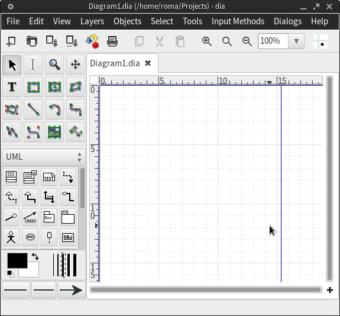

Оказывается, dia все таки умеет работать в одном окне:\
\
\$ dia --integrated\
\

[{border="0" height="297" width="320"}](images/image-01.png){imageanchor="1" style="margin-left: 1em; margin-right: 1em;"}

\
Столько времени мучился пока не нашел эту опцию, почему это не сделано по дефолту?
