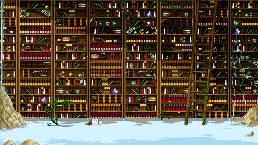

\
**Про строки **\

  ------------------------------------------------------------------------------------------------------------------------------------------------------
   [{border="0" height="180" width="320"}](images/image-01.png){imageanchor="1" style="margin-left: auto; margin-right: auto;"}
                                           [binoftrash](http://binoftrash.deviantart.com/art/Library-431032895)
  ------------------------------------------------------------------------------------------------------------------------------------------------------

\
UTF-8 Everywhere - Manifesto - <http://www.utf8everywhere.org/>\
\
Катастрофа Unicode в Python3 - <http://habrahabr.ru/post/208192/>\
\
Назад, к основам  - <http://russian.joelonsoftware.com/Articles/BacktoBasics.html>\
(*очень правильная статья*)\
\
**Python**/разработка\
\
Блог человека, изучающего питон (довольно интересно почитать) - <http://www.mypythonadventure.com/>\
\
Назад, к технологиям верхнего палеолита, от любимых всеми REST, STATEless, CRUD, CGI, FastСGI и MVC - <http://habrahabr.ru/post/204958/> (note: я не согласен со статьей, но мнение интересное)\
\
Don't use Gunicorn to host your Django sites on Heroku - <http://blog.etianen.com/blog/2014/01/19/gunicorn-heroku-django/>\
\
\
**Минутка паранойи**\
\
RSA Security получила \$10 млн. от АНБ за использование заведомо дырявого генератора псевдослучайных чисел  - <http://habrahabr.ru/post/200266/>\
\
\
**Научно-популярное**\
\
Academia. Александр Коновалов. Супрамолекулярные системы - мост между неживой и живой материей - <http://www.youtube.com/watch?v=3lMc8XT-uBM> (мало что понял, но интересно)\
\
\
\
**Разное**\
\
Молчание гуглят, или Гроздья народного гнева - <http://blogerator.ru/page/molchanie-gugljat-ili-grozdja-narodnogo-gneva-google-protesty-avtobus> (btw, интересный блог [blogerator.ru](http://blogerator.ru/))\
\
Программирование - работа на износ? - <http://blogerator.ru/page/programmirovanie-rabota-na-iznos-karera-trudogolik-pererabotka>\
\
Управленческие инструменты: 4-фазный алгоритм решения проблем с людьми или “А чего ты хочешь, если ты такой хреновый менеджер?”  - <http://habrahabr.ru/company/stratoplan/blog/211106/>\
\
