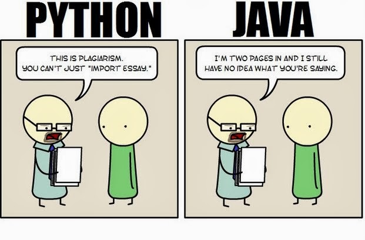

**Python**\
\
Мысли о Python 3 - <http://habrahabr.ru/post/147281/>\
\
Python Idioms - <http://safehammad.com/downloads/python-idioms-2014-01-16.pdf> simple but\
\
Python with Braces project - <http://www.pythonb.org/> (weird =) )\
\

[{border="0" height="210" width="320"}](images/image-01.jpg){style="margin-left: 1em; margin-right: 1em;"}

\
**Техническое**\
\
Объяснение сути Heartbleed в виде комикса - <http://blogerator.ru/page/heartbleed-v-vide-komiksa-openssl-bag-oshibka>\
\
How To Get Experience Working With Large Datasets - <http://www.bigfastblog.com/how-to-get-experience-working-with-large-datasets>\
\
The Apache Projects – The Justice League Of Scalability - <http://www.bigfastblog.com/the-apache-projects-the-justice-league-of-scalability>\
\
Баг Шредингера (schroedinbug) - <http://catb.org/jargon/html/S/schroedinbug.html>\
\
An Icehouse Sneak Peek – OpenStack Networking (Neutron) - <http://redhatstackblog.redhat.com/2014/04/16/an-icehouse-sneak-peek-openstack-networking-neutron/>\
\
**Художественное**\
\
Страна садов / Garden State - <http://www.ex.ua/120150>\
\
День открытых дверей - <http://gerasim-st.narod.ru/text/vorota.html>\
\
**Разное**\
\
Новые работы у iCube - <http://zyalt.livejournal.com/1042689.html>\
\
Завершено строительство самой большой в мире термальной солнечной электростанции  - <http://habrahabr.ru/post/212771/>\
\
Дэниел Сиберг: Как перестать воспринимать смартфон как часть тела  - <http://habrahabr.ru/company/yotadevices/blog/218537/>\
\
Are wearables just a fad? - <http://pleasediscuss.com/andimann/20140403/are-wearables-just-a-fad/>\
\
\
