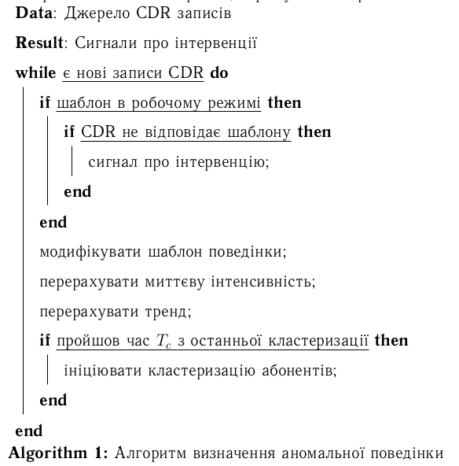
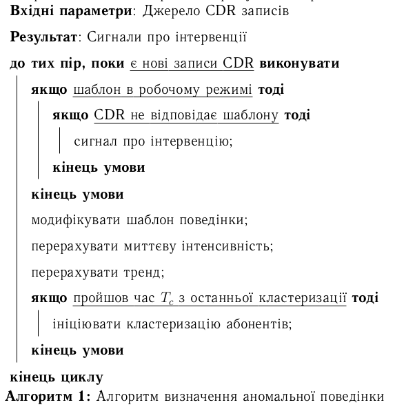

Для вставлення псевдокоду в латех документи є кілька пакетів, я працював із algorithm2e.\
\
Звісно псевдокод можна вставити як звичайний текст моноширинним шрифтом, але він виглядає набагато краще, коли він оформлений з підсвітлюванням синтаксису.\
\
Я не буду писати як загалом працювати із пакетом **algorithm2e**, тому що в мережі є [детальні](http://en.wikibooks.org/wiki/LaTeX/Algorithms) [інструкції](http://blog.harrix.org/?p=648), [документація](http://blog.harrix.org/wp-content/uploads/2013/04/algorithm2e.pdf), та [інше](https://www.google.com.ua/search?q=algorithm2e+latex+examples).\
\
Для використання пакету в україномовних документах, потрібна локалізація для ключових слів та операторів. Викладаю свій переклад (потрібно додати в преамбулу документу):\
\

\\SetKwInput{KwData}{Вхідні параметри}\
\\SetKwInput{KwResult}{Результат}\
\\SetKwInput{KwIn}{Вхідні дані}\
\\SetKwInput{KwOut}{Вихідні данные}\
\\SetKwIF{If}{ElseIf}{Else}{якщо}{тоді}{інакше\\ якщо}{інакше}{кінець\\ умови}\
\\SetKwFor{While}{до\\ тих\\ пір,\\ поки}{виконувати}{кінець\\ циклу}\
\\SetKw{KwTo}{від}\
\\SetKw{KwRet}{повернути}\
\\SetKw{Return}{повернути}\
\\SetKwBlock{Begin}{початок\\ блоку}{кінець\\ блоку}\
\\SetKwSwitch{Switch}{Case}{Other}{Перевірити\\ значення}{та\\ виконати}{варіант}{інакше}{кінець\\ варианту}{кінець\\ перевірки\\ значень}\
\\SetKwFor{For}{цикл}{виконувати}{кінець\\ циклу}\
\\SetKwFor{ForEach}{для\\ кожного}{виконувати}{кінець\\ циклу}\
\\SetKwRepeat{Repeat}{повторювати}{до\\ тих\\ пір,\\ поки}\
\\SetAlgorithmName{Алгоритм}{алгоритм}{Список алгоритмів}

\

\
\
\
Було:\

[{border="0" height="320" width="315"}](images/image-01.png){imageanchor="1" style="margin-left: 1em; margin-right: 1em;"}

Стало:\

[{border="0" height="320" width="310"}](images/image-02.png){imageanchor="1" style="margin-left: 1em; margin-right: 1em;"}

\
