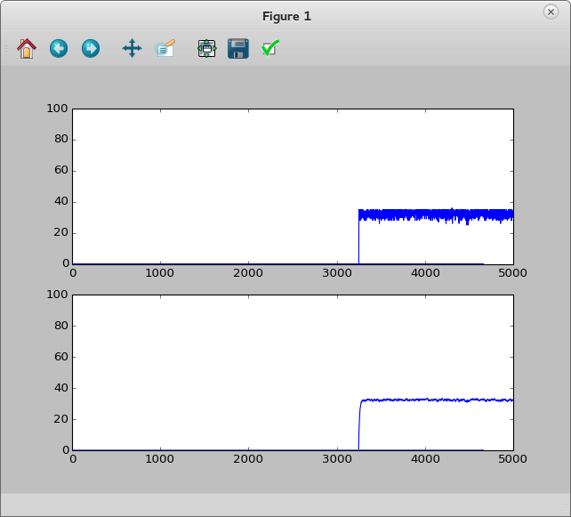
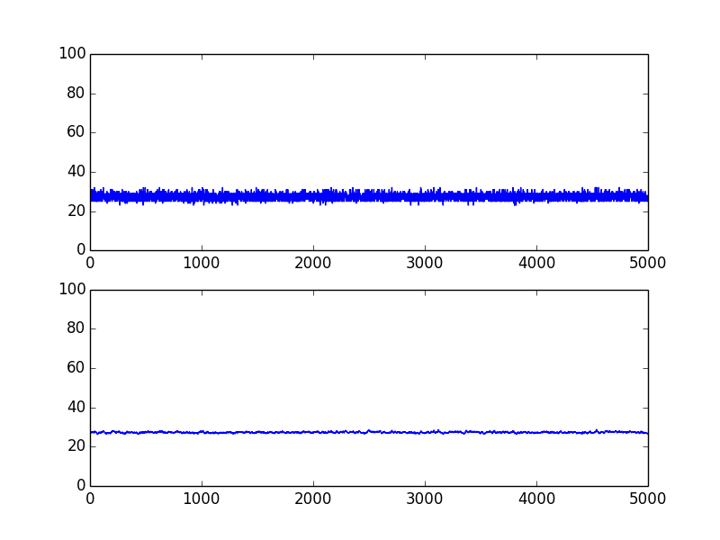

[{border="0" height="289" width="320"}](images/image-01.png){imageanchor="1" style="clear: right; float: right; margin-bottom: 1em; margin-left: 1em;"}I've finally got something for post.\
\
Last month I've been playing with the TI MSP430 Launchpad and when I work with ADC it lacks of visualization. Since Launchpad have UART-USB interface, I decided to plot incoming data.\
\
[I'm using MSP430G2553, and all code was written for this controller.]{.underline}\
\

## Firmware

Firmware of controller is pretty straightforward in large scale: it just sends value from ADC to the UART continously - with one note: before start to send anything, we need to make a "handshake" - receive start symbol from computer. So, high-level algorithm will be like this:\
1) Initialize UART\[1\] (9600 baud) and ADC\[2\]\
2) Wait for start signal ("handshake")\
3) In forever loop send temperature to UART\
\
ADC initialization to read temperature (10 channel):\
void ADC_init(void) {\
    ADC10CTL0 = SREF_1 + REFON + ADC10ON + ADC10SHT_3;\
    ADC10CTL1 = INCH_10 + ADC10DIV_3;\
}\
\
int getTemperatureCelsius()\
{\
    int t = 0;\
    \_\_delay_cycles(1000); // Not neccessary.\
    ADC10CTL0 \|= ENC + ADC10SC;\
    while (ADC10CTL1 & BUSY);\
    t = ADC10MEM;\
    ADC10CTL0 &=\~ ENC;\
    return(int) ((t \* 27069L - 18169625L) \>\> 16);  // magic conversion to Celsius\
}\
\
Handshake:\
  // UART Handshake...\
  unsigned char c;\
  while ((c = uart_getc()) != '1');\
  uart_puts((char \*)"\\nOK\\n");\
\
We're waiting for '1' and sending "OK" when we receive it.\
\
After that, program starts to send temperature indefinitely:\
\
\
  while(1) {\
    uart_printf("%i\\n", getTemperatureCelsius());\
    P1OUT \^= 0x1;\
  }\
\
uart_printf converts integer value into string and send over UART \[3\].\
\
The source code of firmware in the bottom of this post.\
\

## Plotting Application

I love *matplotlib* in python, it's great library to plot everything.To read data from UART, I used *pySerial* library. That's all we need.\
\
When we connect launchpad to computer, device /dev/ttyACM0 is created. It's serial port which we need to use.\
\
Application consists of two threads:\

1.  Serial port processing
2.  Continous plot updating

### Serial port processing

Let's define global variable data = deque(0 for \_ in range(5000)), it will contain data to plot and dataP = deque(0 for \_ in range(5000)), it will contain approximated values.\
\
In the serial port thread, we need to open connection:\
ser = serial.Serial('/dev/ttyACM0', 9600, timeout=1)\
then, make a "handshake":\
    ok = b''\
    while ok.strip() != b'OK':\
        ser.write(b"1")\
        ok = ser.readline()\
    print("Handshake OK!\\n")\
As you see, we're waiting the "OK" in response to "1". After "handshake", we can start reading data:\
\
    while True:\
        try:\
            val = int(ser.readline().strip())\
            addValue(val)\
        except ValueError:\
            pass\
\
UART is not very stable, so sometimes you can receive distorted data. That's why I eat exceptions.\
\
*addValue* here is function that processes data and puts it to *data* variable:\
\
avg = 0\
def addValue(val):\
    global avg\
\
    data.append(val)\
    data.popleft()\
   \
    avg = avg + 0.1 \* (val - avg)\
    dataP.append(avg)\
    dataP.popleft()\
\
Also it calculates weighted moving average:\

[{border="0"}](images/image-02.png){imageanchor="1" style="margin-left: 1em; margin-right: 1em;"}

\

### Continous plot updating 

First, let's create figure with two plots:\
\
    fig, (p1, p2) = plt.subplots(2, 1)\
    plot_data, = p1.plot(data, animated=True)\
    plot_processed, = p2.plot(data, animated=True)\
    p1.set_ylim(0, 100)  \# y limits\
    p2.set_ylim(0, 100)\
\
To draw animated plot, we need to define function that will update data:\
\
    def animate(i):\
        plot_data.set_ydata(data)\
        plot_data.set_xdata(range(len(data)))\
        plot_processed.set_ydata(dataP)\
        plot_processed.set_xdata(range(len(dataP)))\
        return \[plot_data, plot_processed\]\
\
    ani = animation.FuncAnimation(fig, animate, range(10000),\
                                  interval=50, blit=True)\
And show the plot window:\
    plt.show()\
\
Here's the result of program's work:\
\

[{border="0" height="300" width="400"}](images/image-03.png){style="margin-left: 1em; margin-right: 1em;"}

On the first plot it's raw data received through serial port, on the second it's average.\

## Source codes

\
Desktop live plotting application:\
\
\

+---------------------------------------------+----------------------------------------------------------------+
| ``` {style="line-height: 125%; margin: 0;"} | ``` {style="line-height: 125%; margin: 0;"}                    |
|  1                                          | import matplotlib.pyplot as plt                                |
|  2                                          | import matplotlib.animation as animation                       |
|  3                                          | import serial                                                  |
|  4                                          | import threading                                               |
|  5                                          | from collections import deque                                  |
|  6                                          |                                                                |
|  7                                          | data = deque(0 for _ in range(5000))                           |
|  8                                          | dataP = deque(0 for _ in range(5000))                          |
|  9                                          | avg = 0                                                        |
| 10                                          |                                                                |
| 11                                          | def addValue(val):                                             |
| 12                                          |     global avg                                                 |
| 13                                          |                                                                |
| 14                                          |     data.append(val)                                           |
| 15                                          |     data.popleft()                                             |
| 16                                          |                                                                |
| 17                                          |     avg = avg + 0.1 * (val - avg)                              |
| 18                                          |     dataP.append(avg)                                          |
| 19                                          |     dataP.popleft()                                            |
| 20                                          |                                                                |
| 21                                          |                                                                |
| 22                                          | def msp430():                                                  |
| 23                                          |     print("Connecting...")                                     |
| 24                                          |     ser = serial.Serial('/dev/ttyACM0', 9600, timeout=1)       |
| 25                                          |     print("Connected!")                                        |
| 26                                          |                                                                |
| 27                                          |     # Handshake...                                             |
| 28                                          |     ok = b''                                                   |
| 29                                          |     while ok.strip() != b'OK':                                 |
| 30                                          |         ser.write(b"1")                                        |
| 31                                          |         ok = ser.readline()                                    |
| 32                                          |         print(ok.strip())                                      |
| 33                                          |     print("Handshake OK!\n")                                   |
| 34                                          |                                                                |
| 35                                          |     while True:                                                |
| 36                                          |         try:                                                   |
| 37                                          |             val = int(ser.readline().strip())                  |
| 38                                          |             addValue(val)                                      |
| 39                                          |             print(val)                                         |
| 40                                          |         except ValueError:                                     |
| 41                                          |             pass                                               |
| 42                                          |                                                                |
| 43                                          |                                                                |
| 44                                          | if __name__ == "__main__":                                     |
| 45                                          |     threading.Thread(target=msp430).start()                    |
| 46                                          |                                                                |
| 47                                          |     fig, (p1, p2) = plt.subplots(2, 1)                         |
| 48                                          |     plot_data, = p1.plot(data, animated=True)                  |
| 49                                          |     plot_processed, = p2.plot(data, animated=True)             |
| 50                                          |     p1.set_ylim(0, 100)                                        |
| 51                                          |     p2.set_ylim(0, 100)                                        |
| 52                                          |     def animate(i):                                            |
| 53                                          |         plot_data.set_ydata(data)                              |
| 54                                          |         plot_data.set_xdata(range(len(data)))                  |
| 55                                          |         plot_processed.set_ydata(dataP)                        |
| 56                                          |         plot_processed.set_xdata(range(len(dataP)))            |
| 57                                          |         return [plot_data, plot_processed]                     |
| 58                                          |                                                                |
| 59                                          |     ani = animation.FuncAnimation(fig, animate, range(10000),  |
| 60                                          |                                   interval=50, blit=True)      |
| 61                                          |     plt.show()                                                 |
| ```                                         | ```                                                            |
+---------------------------------------------+----------------------------------------------------------------+

\
\
MSP430 full firmware:\
\

+---------------------------------------------+-------------------------------------------------------------------------------------------------------------------+
| ``` {style="line-height: 125%; margin: 0;"} | ``` {style="line-height: 125%; margin: 0;"}                                                                       |
|   1                                         | /*                                                                                                                |
|   2                                         | NOTICE                                                                                                            |
|   3                                         | Used code or got an idea from:                                                                                    |
|   4                                         |     UART: Stefan Wendler - http://gpio.kaltpost.de/?page_id=972                                                   |
|   5                                         |     ADC: http://indiantinker.wordpress.com/2012/12/13/tutorial-using-the-internal-temperature-sensor-on-a-msp430/ |
|   6                                         |     printf: http://forum.43oh.com/topic/1289-tiny-printf-c-version/                                               |
|   7                                         | */                                                                                                                |
|   8                                         |                                                                                                                   |
|   9                                         | #include <msp430g2553.h>                                                                                          |
|  10                                         |                                                                                                                   |
|  11                                         | // =========== HEADERS ===============                                                                            |
|  12                                         | // UART                                                                                                           |
|  13                                         | void uart_init(void);                                                                                             |
|  14                                         | void uart_set_rx_isr_ptr(void (*isr_ptr)(unsigned char c));                                                       |
|  15                                         | unsigned char uart_getc();                                                                                        |
|  16                                         | void uart_putc(unsigned char c);                                                                                  |
|  17                                         | void uart_puts(const char *str);                                                                                  |
|  18                                         | void uart_printf(char *, ...);                                                                                    |
|  19                                         | // ADC                                                                                                            |
|  20                                         | void ADC_init(void);                                                                                              |
|  21                                         | // =========== /HEADERS ===============                                                                           |
|  22                                         |                                                                                                                   |
|  23                                         |                                                                                                                   |
|  24                                         | // Trigger on received character                                                                                  |
|  25                                         | void uart_rx_isr(unsigned char c) {                                                                               |
|  26                                         |   P1OUT ^= 0x40;                                                                                                  |
|  27                                         | }                                                                                                                 |
|  28                                         |                                                                                                                   |
|  29                                         | int main(void)                                                                                                    |
|  30                                         | {                                                                                                                 |
|  31                                         |   WDTCTL = WDTPW + WDTHOLD;                                                                                       |
|  32                                         |                                                                                                                   |
|  33                                         |   BCSCTL1 = CALBC1_8MHZ; //Set DCO to 8Mhz                                                                        |
|  34                                         |   DCOCTL = CALDCO_8MHZ; //Set DCO to 8Mhz                                                                         |
|  35                                         |                                                                                                                   |
|  36                                         |   P1DIR = 0xff;                                                                                                   |
|  37                                         |   P1OUT = 0x1;                                                                                                    |
|  38                                         |   ADC_init();                                                                                                     |
|  39                                         |   uart_init();                                                                                                    |
|  40                                         |   uart_set_rx_isr_ptr(uart_rx_isr);                                                                               |
|  41                                         |                                                                                                                   |
|  42                                         |   __bis_SR_register(GIE); // global interrupt enable                                                              |
|  43                                         |                                                                                                                   |
|  44                                         |   // UART Handshake...                                                                                            |
|  45                                         |   unsigned char c;                                                                                                |
|  46                                         |   while ((c = uart_getc()) != '1');                                                                               |
|  47                                         |   uart_puts((char *)"\nOK\n");                                                                                    |
|  48                                         |                                                                                                                   |
|  49                                         |   ADC10CTL0 |= ADC10SC;                                                                                           |
|  50                                         |   while(1) {                                                                                                      |
|  51                                         |     uart_printf("%i\n", getTemperatureCelsius());                                                                 |
|  52                                         |     P1OUT ^= 0x1;                                                                                                 |
|  53                                         |   }                                                                                                               |
|  54                                         | }                                                                                                                 |
|  55                                         |                                                                                                                   |
|  56                                         | // ========================================================                                                       |
|  57                                         | // ADC configured to read temperature                                                                             |
|  58                                         | void ADC_init(void) {                                                                                             |
|  59                                         |     ADC10CTL0 = SREF_1 + REFON + ADC10ON + ADC10SHT_3;                                                            |
|  60                                         |     ADC10CTL1 = INCH_10 + ADC10DIV_3;                                                                             |
|  61                                         | }                                                                                                                 |
|  62                                         |                                                                                                                   |
|  63                                         | int getTemperatureCelsius()                                                                                       |
|  64                                         | {                                                                                                                 |
|  65                                         |     int t = 0;                                                                                                    |
|  66                                         |     __delay_cycles(1000);                                                                                         |
|  67                                         |     ADC10CTL0 |= ENC + ADC10SC;                                                                                   |
|  68                                         |     while (ADC10CTL1 & BUSY);                                                                                     |
|  69                                         |     t = ADC10MEM;                                                                                                 |
|  70                                         |     ADC10CTL0 &=~ ENC;                                                                                            |
|  71                                         |     return(int) ((t * 27069L - 18169625L) >> 16);                                                                 |
|  72                                         | }                                                                                                                 |
|  73                                         |                                                                                                                   |
|  74                                         |                                                                                                                   |
|  75                                         | // ========================================================                                                       |
|  76                                         | // UART                                                                                                           |
|  77                                         | #include <legacymsp430.h>                                                                                         |
|  78                                         |                                                                                                                   |
|  79                                         | #define RXD BIT1                                                                                                  |
|  80                                         | #define TXD BIT2                                                                                                  |
|  81                                         |                                                                                                                   |
|  82                                         | /**                                                                                                               |
|  83                                         | * Callback handler for receive                                                                                    |
|  84                                         | */                                                                                                                |
|  85                                         | void (*uart_rx_isr_ptr)(unsigned char c);                                                                         |
|  86                                         |                                                                                                                   |
|  87                                         | void uart_init(void)                                                                                              |
|  88                                         | {                                                                                                                 |
|  89                                         |   uart_set_rx_isr_ptr(0L);                                                                                        |
|  90                                         |                                                                                                                   |
|  91                                         |   P1SEL = RXD + TXD;                                                                                              |
|  92                                         |   P1SEL2 = RXD + TXD;                                                                                             |
|  93                                         |                                                                                                                   |
|  94                                         |   UCA0CTL1 |= UCSSEL_2; //SMCLK                                                                                   |
|  95                                         |   //8,000,000Hz, 9600Baud, UCBRx=52, UCBRSx=0, UCBRFx=1                                                           |
|  96                                         |   UCA0BR0 = 52; //8MHz, OSC16, 9600                                                                               |
|  97                                         |   UCA0BR1 = 0; //((8MHz/9600)/16) = 52.08333                                                                      |
|  98                                         |   UCA0MCTL = 0x10|UCOS16; //UCBRFx=1,UCBRSx=0, UCOS16=1                                                           |
|  99                                         |   UCA0CTL1 &= ~UCSWRST; //USCI state machine                                                                      |
| 100                                         |   IE2 |= UCA0RXIE; // Enable USCI_A0 RX interrupt                                                                 |
| 101                                         | }                                                                                                                 |
| 102                                         |                                                                                                                   |
| 103                                         | void uart_set_rx_isr_ptr(void (*isr_ptr)(unsigned char c))                                                        |
| 104                                         | {                                                                                                                 |
| 105                                         |   uart_rx_isr_ptr = isr_ptr;                                                                                      |
| 106                                         | }                                                                                                                 |
| 107                                         |                                                                                                                   |
| 108                                         | unsigned char uart_getc()                                                                                         |
| 109                                         | {                                                                                                                 |
| 110                                         |   while (!(IFG2&UCA0RXIFG)); // USCI_A0 RX buffer ready?                                                          |
| 111                                         |   return UCA0RXBUF;                                                                                               |
| 112                                         | }                                                                                                                 |
| 113                                         |                                                                                                                   |
| 114                                         | void uart_putc(unsigned char c)                                                                                   |
| 115                                         | {                                                                                                                 |
| 116                                         |   while (!(IFG2&UCA0TXIFG)); // USCI_A0 TX buffer ready?                                                          |
| 117                                         |      UCA0TXBUF = c; // TX                                                                                         |
| 118                                         | }                                                                                                                 |
| 119                                         |                                                                                                                   |
| 120                                         | void uart_puts(const char *str)                                                                                   |
| 121                                         | {                                                                                                                 |
| 122                                         |   while(*str) uart_putc(*str++);                                                                                  |
| 123                                         | }                                                                                                                 |
| 124                                         |                                                                                                                   |
| 125                                         | interrupt(USCIAB0RX_VECTOR) USCI0RX_ISR(void)                                                                     |
| 126                                         | {                                                                                                                 |
| 127                                         |   if(uart_rx_isr_ptr != 0L) {                                                                                     |
| 128                                         |    (uart_rx_isr_ptr)(UCA0RXBUF);                                                                                  |
| 129                                         |   }                                                                                                               |
| 130                                         | }                                                                                                                 |
| 131                                         |                                                                                                                   |
| 132                                         |                                                                                                                   |
| 133                                         |                                                                                                                   |
| 134                                         | // ========================================================                                                       |
| 135                                         | // UART PRINTF                                                                                                    |
| 136                                         | #include "stdarg.h"                                                                                               |
| 137                                         |                                                                                                                   |
| 138                                         | static const unsigned long dv[] = {                                                                               |
| 139                                         | //  4294967296      // 32 bit unsigned max                                                                        |
| 140                                         |     1000000000,     // +0                                                                                         |
| 141                                         |      100000000,     // +1                                                                                         |
| 142                                         |       10000000,     // +2                                                                                         |
| 143                                         |        1000000,     // +3                                                                                         |
| 144                                         |         100000,     // +4                                                                                         |
| 145                                         | //       65535      // 16 bit unsigned max                                                                        |
| 146                                         |          10000,     // +5                                                                                         |
| 147                                         |           1000,     // +6                                                                                         |
| 148                                         |            100,     // +7                                                                                         |
| 149                                         |             10,     // +8                                                                                         |
| 150                                         |              1,     // +9                                                                                         |
| 151                                         | };                                                                                                                |
| 152                                         |                                                                                                                   |
| 153                                         | static void xtoa(unsigned long x, const unsigned long *dp)                                                        |
| 154                                         | {                                                                                                                 |
| 155                                         |     char c;                                                                                                       |
| 156                                         |     unsigned long d;                                                                                              |
| 157                                         |     if(x) {                                                                                                       |
| 158                                         |         while(x < *dp) ++dp;                                                                                      |
| 159                                         |         do {                                                                                                      |
| 160                                         |             d = *dp++;                                                                                            |
| 161                                         |             c = '0';                                                                                              |
| 162                                         |             while(x >= d) ++c, x -= d;                                                                            |
| 163                                         |             uart_putc(c);                                                                                         |
| 164                                         |         } while(!(d & 1));                                                                                        |
| 165                                         |     } else                                                                                                        |
| 166                                         |         uart_putc('0');                                                                                           |
| 167                                         | }                                                                                                                 |
| 168                                         |                                                                                                                   |
| 169                                         | static void puth(unsigned n)                                                                                      |
| 170                                         | {                                                                                                                 |
| 171                                         |     static const char hex[16] = { '0','1','2','3','4','5','6','7','8','9','A','B','C','D','E','F'};               |
| 172                                         |     uart_putc(hex[n & 15]);                                                                                       |
| 173                                         | }                                                                                                                 |
| 174                                         |                                                                                                                   |
| 175                                         | void uart_printf(char *format, ...)                                                                               |
| 176                                         | {                                                                                                                 |
| 177                                         |     char c;                                                                                                       |
| 178                                         |     int i;                                                                                                        |
| 179                                         |     long n;                                                                                                       |
| 180                                         |                                                                                                                   |
| 181                                         |     va_list a;                                                                                                    |
| 182                                         |     va_start(a, format);                                                                                          |
| 183                                         |     while(c = *format++) {                                                                                        |
| 184                                         |         if(c == '%') {                                                                                            |
| 185                                         |             switch(c = *format++) {                                                                               |
| 186                                         |                 case 's':                       // String                                                         |
| 187                                         |                     uart_puts(va_arg(a, char*));                                                                  |
| 188                                         |                     break;                                                                                        |
| 189                                         |                 case 'c':                       // Char                                                           |
| 190                                         |                     uart_putc(va_arg(a, char));                                                                   |
| 191                                         |                     break;                                                                                        |
| 192                                         |                 case 'i':                       // 16 bit Integer                                                 |
| 193                                         |                 case 'u':                       // 16 bit Unsigned                                                |
| 194                                         |                     i = va_arg(a, int);                                                                           |
| 195                                         |                     if(c == 'i' && i < 0) i = -i, uart_putc('-');                                                 |
| 196                                         |                     xtoa((unsigned)i, dv + 5);                                                                    |
| 197                                         |                     break;                                                                                        |
| 198                                         |                 case 'l':                       // 32 bit Long                                                    |
| 199                                         |                 case 'n':                       // 32 bit uNsigned loNg                                           |
| 200                                         |                     n = va_arg(a, long);                                                                          |
| 201                                         |                     if(c == 'l' &&  n < 0) n = -n, uart_putc('-');                                                |
| 202                                         |                     xtoa((unsigned long)n, dv);                                                                   |
| 203                                         |                     break;                                                                                        |
| 204                                         |                 case 'x':                       // 16 bit heXadecimal                                             |
| 205                                         |                     i = va_arg(a, int);                                                                           |
| 206                                         |                     puth(i >> 12);                                                                                |
| 207                                         |                     puth(i >> 8);                                                                                 |
| 208                                         |                     puth(i >> 4);                                                                                 |
| 209                                         |                     puth(i);                                                                                      |
| 210                                         |                     break;                                                                                        |
| 211                                         |                 case 0: return;                                                                                   |
| 212                                         |                 default: goto bad_fmt;                                                                            |
| 213                                         |             }                                                                                                     |
| 214                                         |         } else                                                                                                    |
| 215                                         | bad_fmt:    uart_putc(c);                                                                                         |
| 216                                         |     }                                                                                                             |
| 217                                         |     va_end(a);                                                                                                    |
| 218                                         | }                                                                                                                 |
| ```                                         | ```                                                                                                               |
+---------------------------------------------+-------------------------------------------------------------------------------------------------------------------+

\
\
\
Sources\

- \[1\] UART: Stefan Wendler - <http://gpio.kaltpost.de/?page_id=972>
- \[2\] ADC: <http://indiantinker.wordpress.com/2012/12/13/tutorial-using-the-internal-temperature-sensor-on-a-msp430/>
- \[3\] printf: <http://forum.43oh.com/topic/1289-tiny-printf-c-version/>
