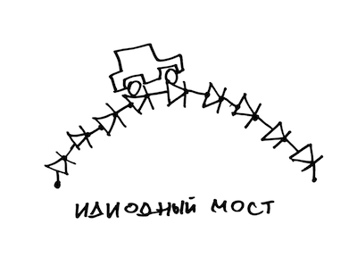
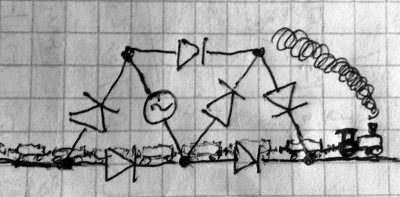

Не могу не поделиться. Сама статья интересная и тоже доставляет, но, как обычно на хабре, коменты доставляют еще больше статьи.\
\
<http://habrahabr.ru/post/233851/>\
\
Самое веселое:\
\
[Vokabre](http://habrahabr.ru/users/Vokabre/){.username}\

[{border="0" height="245" width="320"}](images/image-01.png){imageanchor="1" style="margin-left: 1em; margin-right: 1em;"}

[SHVV](http://habrahabr.ru/users/SHVV/){.username}\

[{border="0" height="157" width="320"}](images/image-02.jpg){imageanchor="1" style="margin-left: 1em; margin-right: 1em;"}

\
\
[Rast1234](http://habrahabr.ru/users/Rast1234/){.username}\
*Похожие ощущения были, когда искал дозиметр. Зашел в какую-то суровую контору. Сидит подобающе суровая тетя напротив меня, я нервно листаю каталог и ищу что-нибудь знакомое или с незапредельной ценой. Офигеваю от ее вопросов про дозиметрию, рабочие параметры, калибровку. Убежал в панике, так и не купил(*\
\
\
[avas](http://habrahabr.ru/users/avas/){.username}\
*не удержался так как сильно напомнило анекдот с баша*\
*\*
*Вообще приходить в первый раз в магазин радиодеталей страшнее, чем первый раз презервативы купить по-моему. Приходишь и так шепотом «мне бы конденсатор на 22Мф», тебя громко спрашивают «какой? Электролит? Тантал? Выводной? SMD?», ты «я не знаааааю» и все оборачиваются сразу, смотрят на тебя осуждающе и пальцами тычут.*\
\
\
[Yggaz](http://habrahabr.ru/users/Yggaz/){.username}\
*Кому анекдот :).*\
*Ни разу не приходилось покупать конденсаторы. А вот когда я вознамерился спаять Covox, решив, что уж с такой-то схемой я справлюсь, понадобились мне резисторы. Ну я и попросил в магазине:*\
*— Можно резисторов по 20 килобайт.*\
*— Каких???*\
*— Любых.*\
*— Сопротивление какое??*\
*— 20 килоба… ой… 20 килоом…*\
*\*
*P.S. Covox я таки спаял, и оно даже заработало.*\
\
\
[MsM78](http://habrahabr.ru/users/MsM78/){.username}\
* Я однажды видел, как два школьника у витрины пытались вспомнить, сколько Ом в одном килооме.*\
*Этот случай не врезался бы в память, но я услышал версию одного из них: «Может 400?» :)*\
\
Всем диодный мост.\
\
P.S. Еще один забавный grammar nazi post - <http://habrahabr.ru/post/231679/>, в коментах, как и полагается, перекрестный ~~огонь из плюсометов~~ поиск ошибок.
