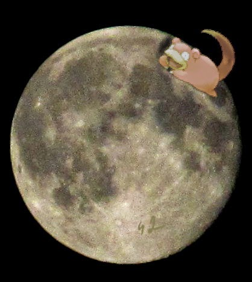
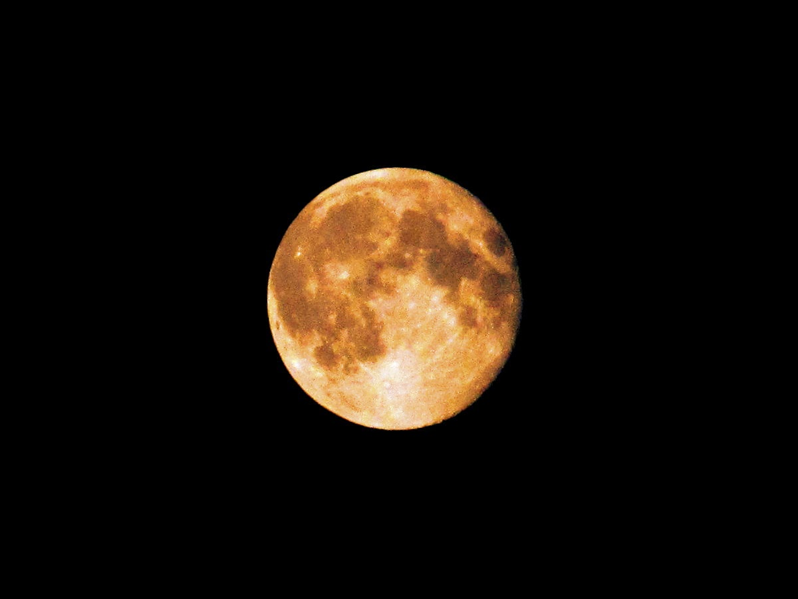
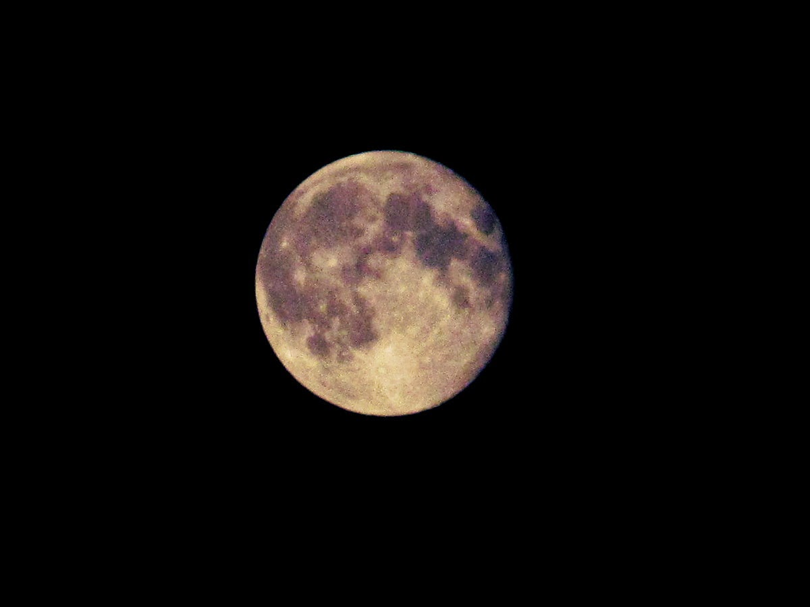
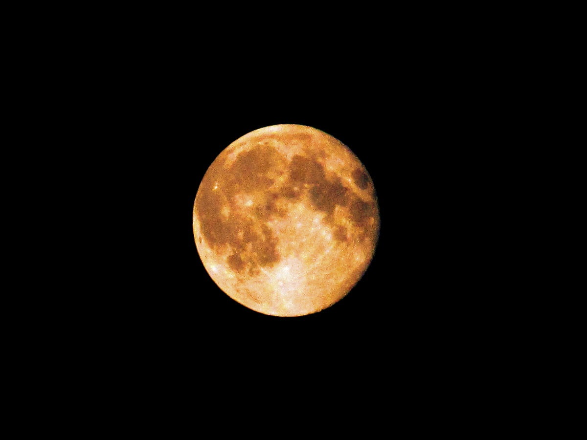
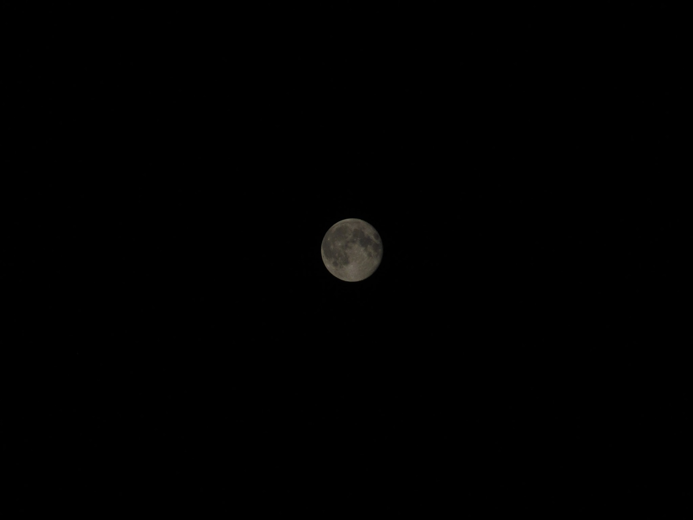
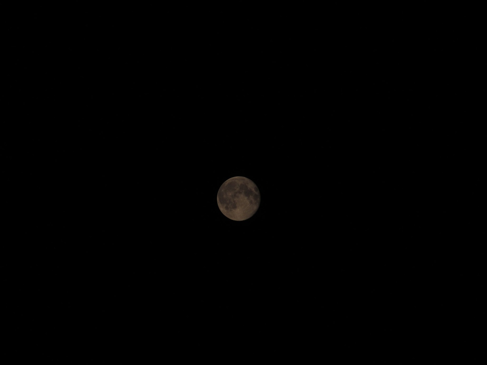
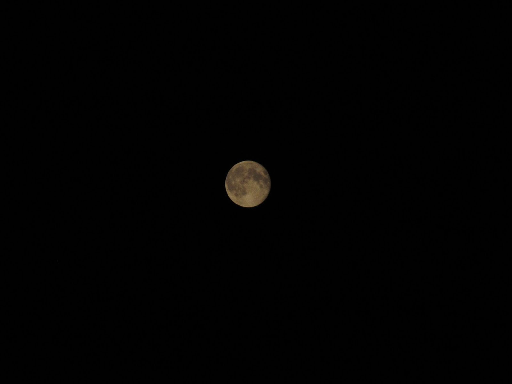

[{border="0" height="320" width="284"}](images/image-01.jpg){imageanchor="1" style="clear: left; float: left; margin-bottom: 1em; margin-right: 1em;"}

С *небольшой* задержкой режил опубликовать фотографии луны, которые я делал в ночь с 11 на 12 августа.\
\
В эти дни проходило [суперлуние](https://ru.wikipedia.org/wiki/%D0%A1%D1%83%D0%BF%D0%B5%D1%80%D0%BB%D1%83%D0%BD%D0%B8%D0%B5), луна видна на 14% больше и на 30% ярче.\
\
\
\
\
\
\
\
\
\
\
\
[]{#more}\
\
1.\

[{border="0" height="480" width="640"}](images/image-02.jpg){imageanchor="1" style="margin-left: 1em; margin-right: 1em;"}

 2.\
\

[{border="0" height="480" width="640"}](images/image-03.jpg){imageanchor="1" style="margin-left: 1em; margin-right: 1em;"}

\
\
 3.\

[{border="0" height="480" width="640"}](images/image-04.jpg){imageanchor="1" style="margin-left: 1em; margin-right: 1em;"}

\
\

4\. Исходные кадры\

[{border="0" height="480" width="640"}](images/image-05.jpg){imageanchor="1" style="margin-left: 1em; margin-right: 1em;"}

\

[{border="0" height="480" width="640"}](images/image-06.jpg){imageanchor="1" style="margin-left: 1em; margin-right: 1em;"}

\

[{border="0" height="480" width="640"}](images/image-07.jpg){imageanchor="1" style="margin-left: 1em; margin-right: 1em;"}
