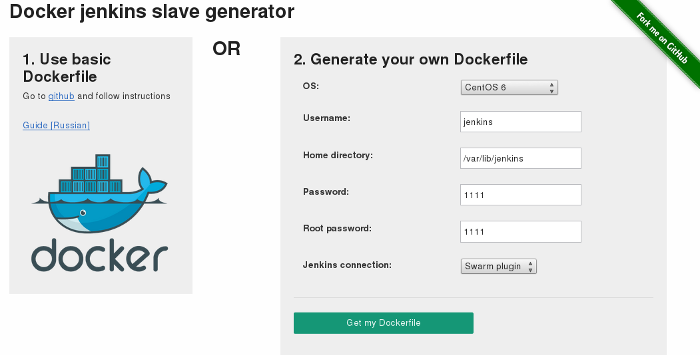

## 

\
tl;dr: Service for generating Dockerfile for Jenkins slaves is up and running here: <http://docker-jenkins-slave.herokuapp.com/> .\

[{border="0" height="162" width="320"}](images/image-01.png){imageanchor="1" style="clear: right; float: right; margin-bottom: 1em; margin-left: 1em;"}

\

## Docker jenkins slave

\

*The beginning of story is here: <http://antigluk.blogspot.com/2013/10/docker-jenkins.html> \[russian\].*

*Abstract: If you want to build your project on different environments (e.g. Jenkins installed on Arch Linux, and you want to build RPM on CentOS 6) with jenkins, but you don't want to use virtual machines, which is inefficient wasting of RAM and CPU, using Docker is good idea.*

\
[]{#more}\

In this repository: <https://github.com/rrader/docker-jenkins-slave> now present build rules for\

- [{border="0" height="165" width="200"}](images/image-02.png){imageanchor="1" style="clear: right; float: right; margin-bottom: 1em; margin-left: 1em;"}
- CentOS 5
- CentOS 6
- Suse 12
- Debian 6

It is assumed that you have installed the Docker and Jenkins.\
\
1) Install Swarm Plugin to your Jenkins (it allows slaves to be added to Jenkins automatically using API)\
\
2) \$ git clone git@github.com:rrader/docker-jenkins-slave.git; cd docker-jenkins-slave\
3) Browse to the folder with the rules for the desired system\
   \$ cd centos6\
4) \$ sudo bash build.sh\
\
Now you have the image, you can add as many nodes of this type as you need:\
\$ sudo bash add_slave.sh SlaveName\
\
After that, assign label for your jenkins job "docker-\<tagname\>", exact tagname for chosen slave OS you can see on wiki: <https://github.com/rrader/docker-jenkins-slave/wiki/Tags>\
\

- centos6 : `centos6.4`
- centos5 : `centos5.4`
- suse12 : `suse12.1`
- squeeze : `debian6 `

## Docker jenkins slave Generator

Initial version of jenkins slave generator was released, it's purpose is to generate Dockerfile exactly for your needs, with preinstalled needed packages and other stuff.\
\
Right now only tiny amount of planned functionality implemented, you can customize username, home directory and root/user password.\
\
App is deployed here:\
<http://docker-jenkins-slave.herokuapp.com/>\
\
Source code of web service is on github: <https://github.com/rrader/docker-jenkins-slave-service>\
\
Any suggestions, pull requests are welcomed!
