----------------------------------------------------------------------------------------------------------------------------------------------------------------------------------------
   [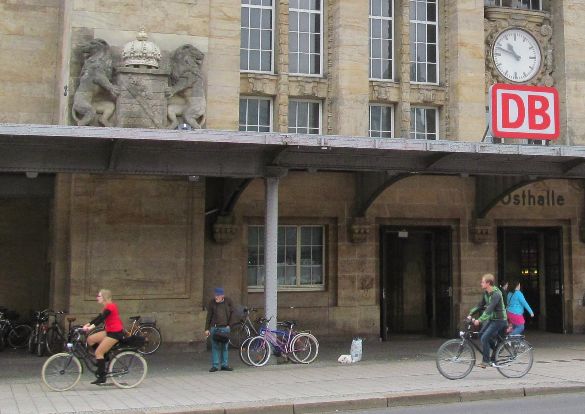{border="0" height="283" width="400"}](images/image-01.jpg){imageanchor="1" style="clear: right; margin-bottom: 1em; margin-left: auto; margin-right: auto;"}
                                                                                       mathematical!
  ----------------------------------------------------------------------------------------------------------------------------------------------------------------------------------------

Не секрет, что в Германии хорошо развита велосипедная инфраструктура. Было бы просто замечательно реализовать хотя бы часть этого в Украине.\
\
У меня тут нет велосипеда, но я немного пофотографировал интересные штуки.\
\
Все картинки кликабельны.\
\
\
\
\
[]{#more}\
\

### Велодорожки

\

Велодорожки по большей части находятся по правую сторону тротуара, выделены другим цветом покрытия (другим цветом плитки, другим узором плитки или другим цветом асфальта)

  ------------------------------------------------------------------------------------------------------------------------------------------------------
   [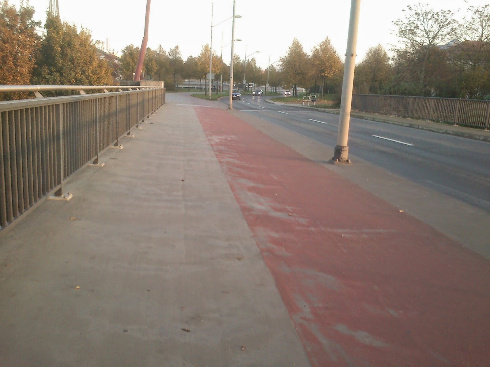{border="0" height="480" width="640"}](images/image-02.jpg){imageanchor="1" style="margin-left: auto; margin-right: auto;"}
                                                                        Magdeburg
  ------------------------------------------------------------------------------------------------------------------------------------------------------

\

Или даже отделены бордюром от проезжей части и тротуара\
\

  ------------------------------------------------------------------------------------------------------------------------------------------------------
   [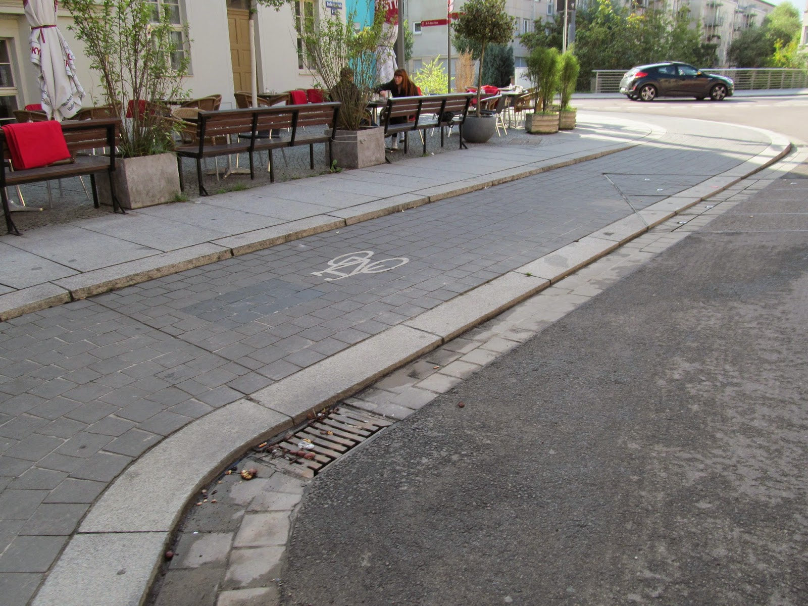{border="0" height="480" width="640"}](images/image-03.jpg){imageanchor="1" style="margin-left: auto; margin-right: auto;"}
                                                                      Halle (Saale)
  ------------------------------------------------------------------------------------------------------------------------------------------------------

\
А может быть просто нарисованной на краю проезжей части (рука не поднялась обрезать фотографию :) )\

  --------------------------------------------------------------------------------------------------------------------------------------
   [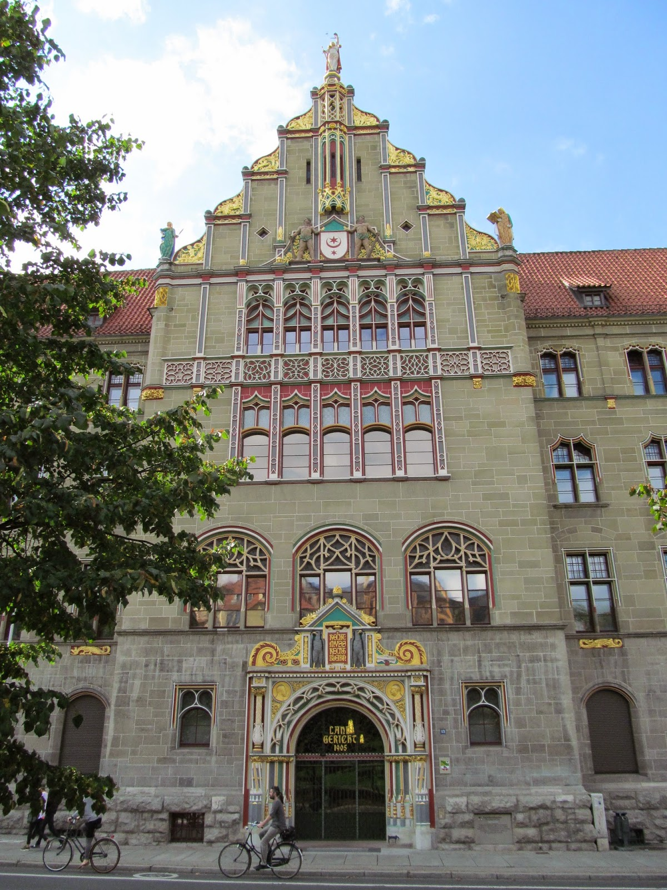{border="0" height="640" width="480"}](images/image-04.jpg){style="margin-left: auto; margin-right: auto;"}
                                                              Halle (Saale)
  --------------------------------------------------------------------------------------------------------------------------------------

Пешеходный переход с велодорожкой. Обратите внимание на светофор.\

  --------------------------------------------------------------------------------------------------------------------------------------
   [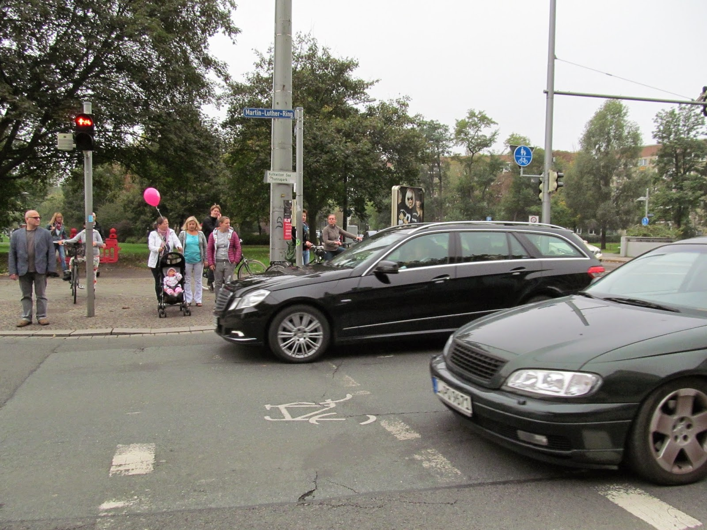{border="0" height="480" width="640"}](images/image-05.jpg){style="margin-left: auto; margin-right: auto;"}
                                                                 Leipzig
  --------------------------------------------------------------------------------------------------------------------------------------

\

Просто перекресток.\
\

  --------------------------------------------------------------------------------------------------------------------------------------
   [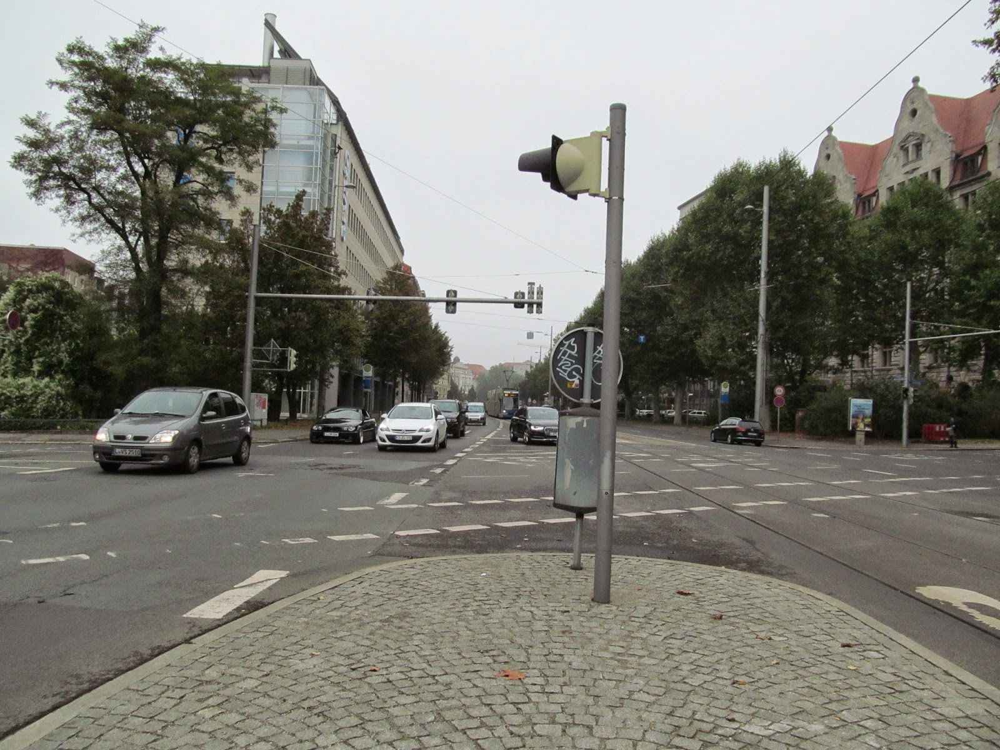{border="0" height="480" width="640"}](images/image-06.jpg){style="margin-left: auto; margin-right: auto;"}
                                                                 Leipzig
  --------------------------------------------------------------------------------------------------------------------------------------

### Парковки

Интересная велопарковка в виде спирали - такие стоят в Магдебурге, просто в случайных местах\

  --------------------------------------------------------------------------------------------------------------------------------------
   [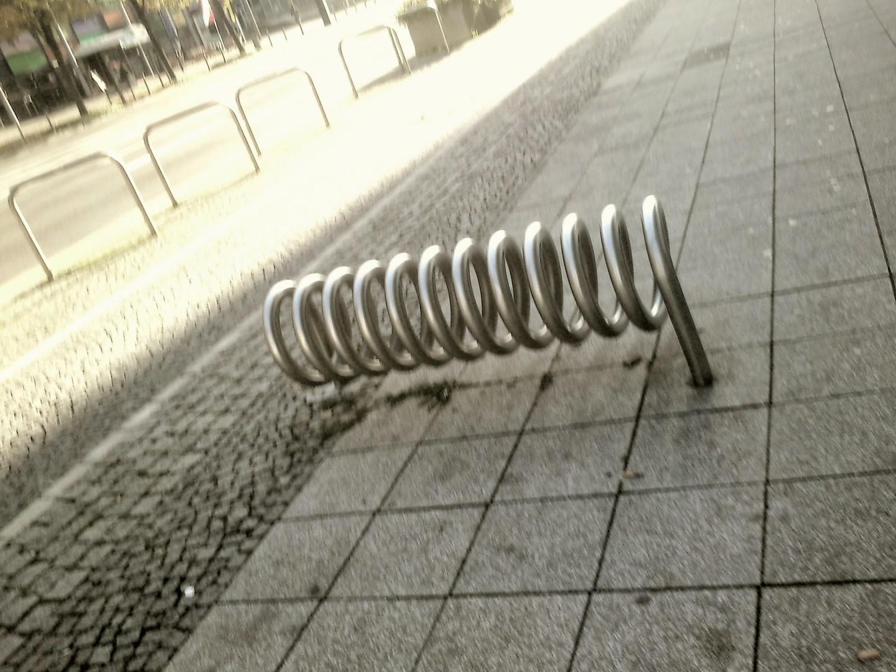{border="0" height="480" width="640"}](images/image-07.jpg){style="margin-left: auto; margin-right: auto;"}
                                                                Magdeburg
  --------------------------------------------------------------------------------------------------------------------------------------

Возле почти любого заведения есть велопарковка\

  --------------------------------------------------------------------------------------------------------------------------------------
   [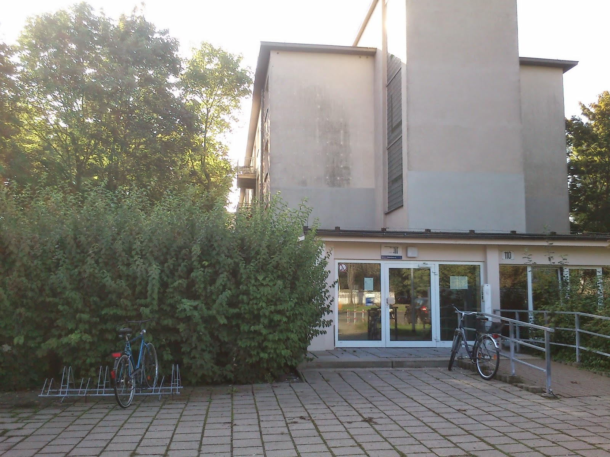{border="0" height="480" width="640"}](images/image-08.jpg){style="margin-left: auto; margin-right: auto;"}
                                                          Merseburg (общежитие)
  --------------------------------------------------------------------------------------------------------------------------------------

\
В институт многие студенты и преподаватели приезжают на велосипедах. Сказывается то, что город маленький, и велосипед является идеальным средством передвижения в нем.\

  ------------------------------------------------------------------------------------------------------------------------------------------------------
   [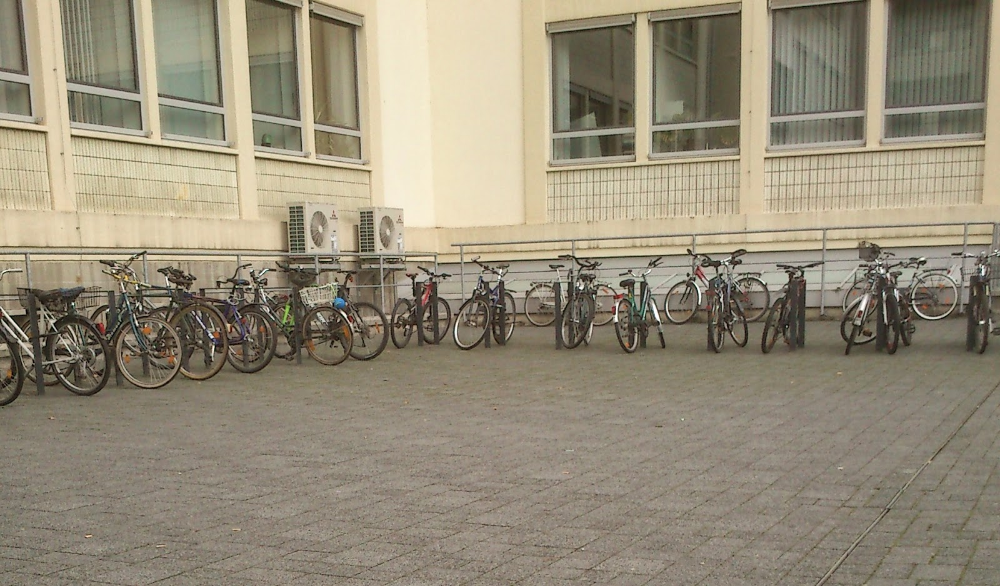{border="0" height="372" width="640"}](images/image-09.jpg){imageanchor="1" style="margin-left: auto; margin-right: auto;"}
                                  Merseburg (Университетская велостоянка, лишь треть где-то - вся не влезла в обьектив)
  ------------------------------------------------------------------------------------------------------------------------------------------------------

\

  ------------------------------------------------------------------------------------------------------------------------------------------------------
   [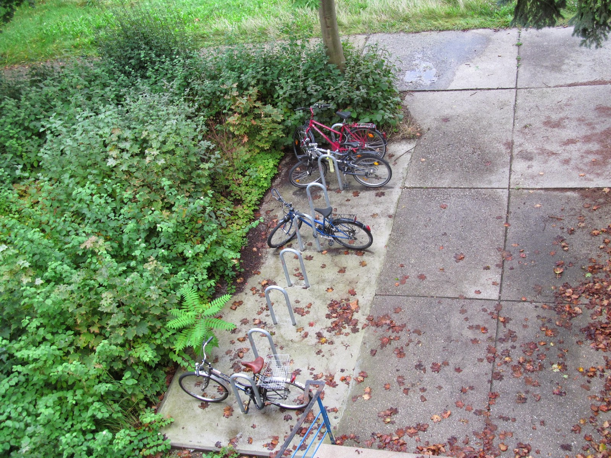{border="0" height="480" width="640"}](images/image-10.jpg){imageanchor="1" style="margin-left: auto; margin-right: auto;"}
                                                                  Merseburg (общежитие)
  ------------------------------------------------------------------------------------------------------------------------------------------------------

\

  ------------------------------------------------------------------------------------------------------------------------------------------------------
   [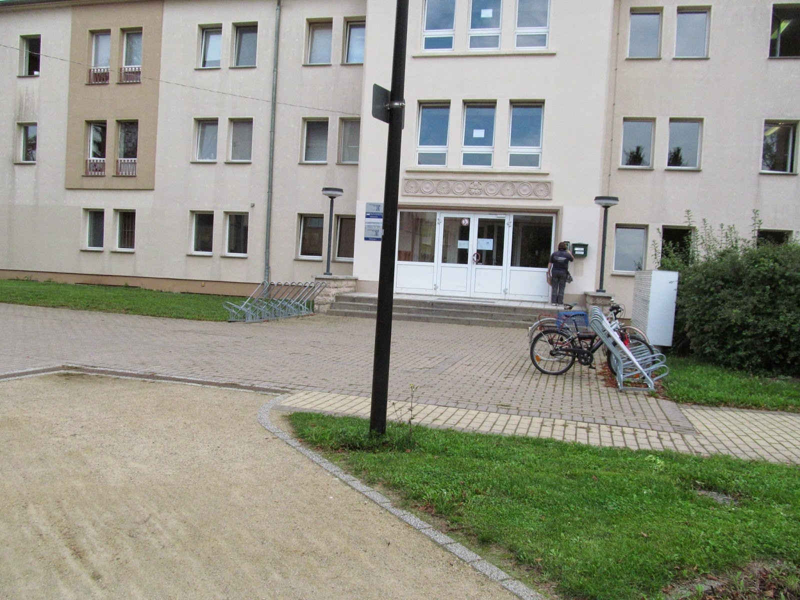{border="0" height="480" width="640"}](images/image-11.jpg){imageanchor="1" style="margin-left: auto; margin-right: auto;"}
                                                                        Merseburg
  ------------------------------------------------------------------------------------------------------------------------------------------------------

\
Просто парковка в городе.\

  --------------------------------------------------------------------------------------------------------------------------------------
   [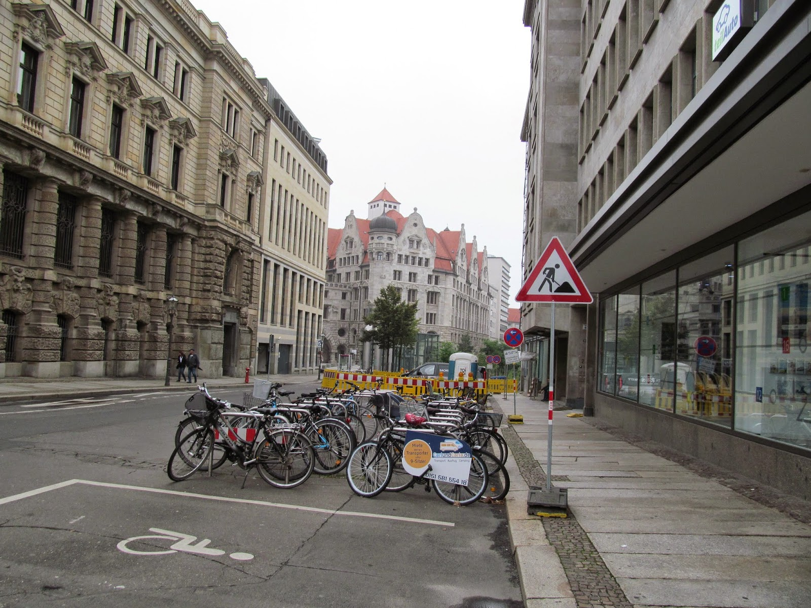{border="0" height="480" width="640"}](images/image-12.jpg){style="margin-left: auto; margin-right: auto;"}
                                                                 Leipzig
  --------------------------------------------------------------------------------------------------------------------------------------

\

### Велокультура

На велосипедах ездят люди всех возрастов. Тут это полноценный транспорт\

  --------------------------------------------------------------------------------------------------------------------------------------
   [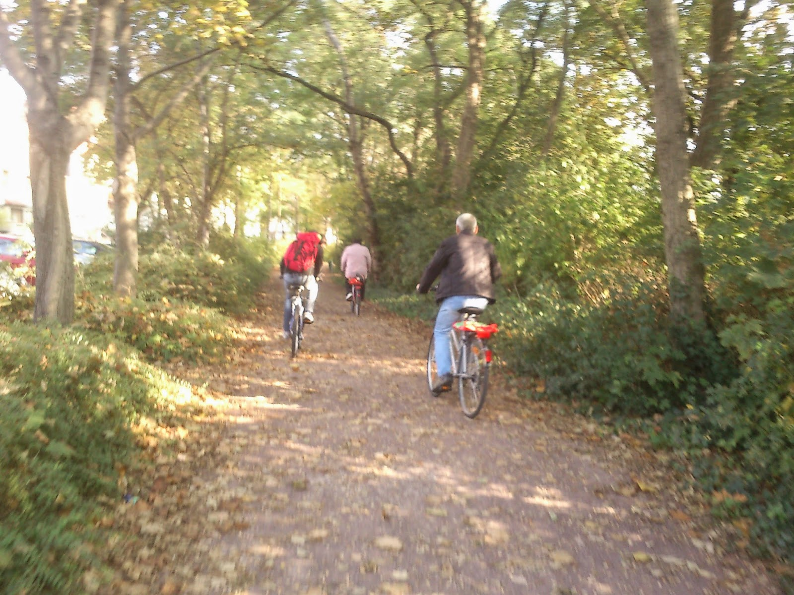{border="0" height="480" width="640"}](images/image-13.jpg){style="margin-left: auto; margin-right: auto;"}
                                                                Merseburg
  --------------------------------------------------------------------------------------------------------------------------------------

Вокзал Лейпцига\

  --------------------------------------------------------------------------------------------------------------------------------------
   [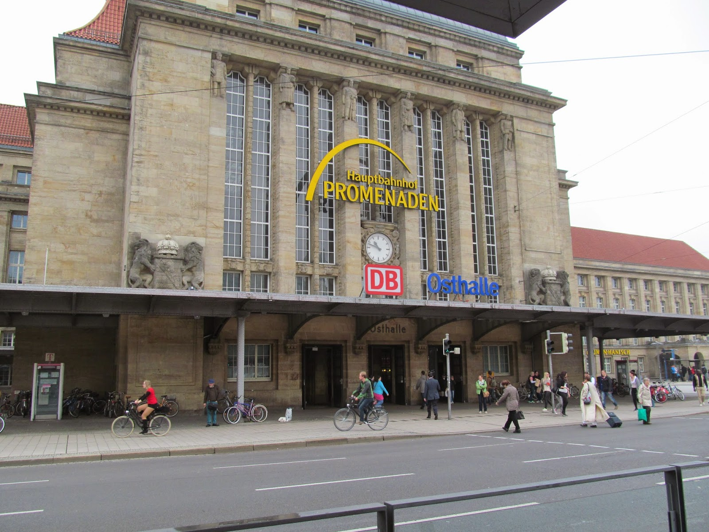{border="0" height="480" width="640"}](images/image-14.jpg){style="margin-left: auto; margin-right: auto;"}
                                                                 Leipzig
  --------------------------------------------------------------------------------------------------------------------------------------

Это очень круто, я считаю.
