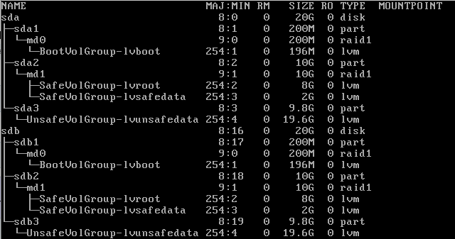

Думаю о постройке домашнего NAS. Хочется обеспечить отказоустойчивость в какой-то мере, так как терять некоторые данные достаточно болезненно.\
\
Вряд ли у меня будет больше двух дисков, поэтому разные RAID5 или RAID10 не рассматриваются. А RAID1 использовать на весь массив - жаба душит, ведь получаю в 2 раза меньше пространства.\
\
Поэтому рабочий вариант такой: два диска делятся на 2 раздела: отказоустойчивый, поменьше, и общий - побольше.\
\
В отказоустойчивый раздел должна быть помещена сама система, и критичные к потере данные.\
В общем разделе - собственно данные, которые потерять не жалко: фильмы, музыка, загрузки торрентов и т.д.\
\
Пришел к такой топологии (два диска по 20 гиг на виртуалке просто для того чтоб потестить):\

[{border="0" height="336" width="640"}](images/image-01.png){imageanchor="1" style="margin-left: 1em; margin-right: 1em;"}

\
[]{#more}\
\
То есть, на **первом уровне**:\
Два физических диска, разделенных на 3 раздела:\

- sda1/sdb1 - /boot,
- sda2/sdb2 - "безопасный", отказоустойчивый раздел
- sda3/sdb3 - общий раздел

\
Далее, на **втором уровне**,\

- sda1 и sdb1 объединены в RAID1 (*mdadm* --level=1) в устройство md0
- sda2 и sdb2 объединены в RAID1 в устройство md1

 На **третьем уровне** с помощью LVM созданы разделы\

- Для /boot на md0 (зеркалированые sda1 и sdb1)
- На md1 созданы два раздела, один для "/" - системы, второй для хранения безопасных данных (зеркалированные sda2 и sdb2)
- И в обход RAID, sda3 и sdb3 объединены в один LVM раздел для хранения общих данных (объемы разделов суммируются).

Полезные ссылки:\
[Software RAID and LVM](https://wiki.archlinux.org/index.php/Software_RAID_and_LVM)\
[RAID](https://wiki.archlinux.org/index.php/RAID)
