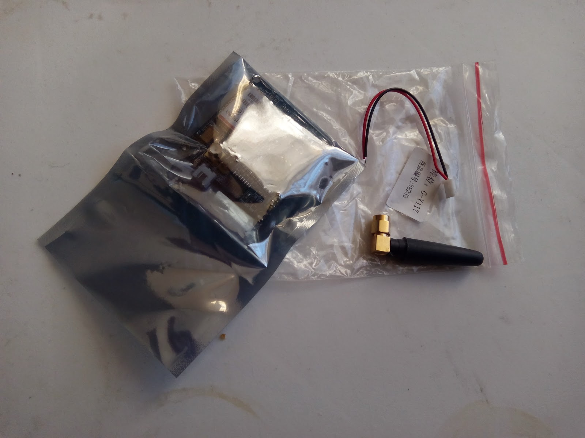
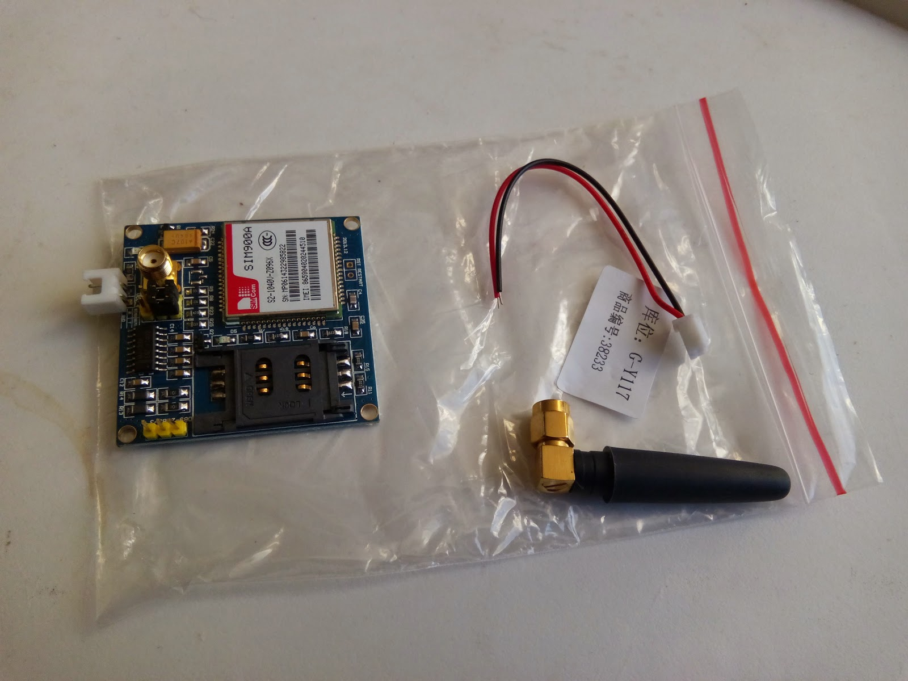

[Подключение MSP430 к SIM900A](http://antigluk.blogspot.com/2015/01/msp430-interfacing-to-sim900a.html)\
[UART-монитор - наблюдение за передачей данных по UART](http://antigluk.blogspot.com/2015/01/uart-uart.html)\
\
Заказал я распаяный SIM900A на плате *SIM900A Mini v3.4*, не разобравшись до конца в чем отличие модификации SIM900A от SIM900. Основное отличие - SIM900A работает в dual-band диапазоне, а SIM900 - в quad-band. Казалось бы, для Украины dual-band должен подходить идеально. **Но нет.**\
\
SIM900A имеет **[региональную блокировку](http://www.blog.zapro.dk/?p=368).**\
Вот список стран, в которых можно использовать SIM900A:\
\
[]{#more}\
\
``{=html}\

  ----------------------------------- -----------------------------------
  **Country**                         **Supported MCCs**

  China                               460

  India                               404/405

  Singapore                           525

  Malaysia                            502

  Thailand                            520

  Indonesia                           510

  Cambodia                            456

  Vietnam                             452

  Laos                                457

  Burma                               414

  Brunei                              528

  Philippines                         515

  East Timor                          514
  ----------------------------------- -----------------------------------

\
\
\
 Пришла мне такая железка:\
\

[{border="0" height="240" width="320"}](images/image-01.jpg){imageanchor="1" style="margin-left: 1em; margin-right: 1em;"}

\

[{border="0" height="240" width="320"}](images/image-02.jpg){imageanchor="1" style="margin-left: 1em; margin-right: 1em;"}

Долго игрался с подключением, и когда в итоге получилось отправлять AT комманды, обнаружилось странное: девайс видит сети (поиск сети "AT+COPS=?" работает), видит симку и оператора симки. Но не регистрируется в сети:\
\
AT+CREG?\
+CREG: 1,0\
OK\
\
AT+CPIN?\
+CPIN: PH-NET PIN\
OK\
\
После гугления, выяснилось, что выделенный ответ означает, что девайс **залочен**.\
\
Поэтому, избегайте покупки чипов SIM900A, без буквы А - лучше.
