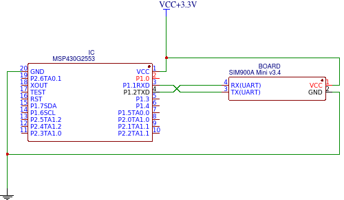
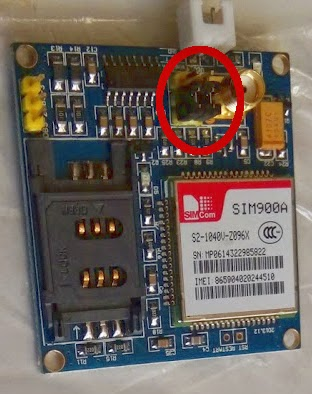
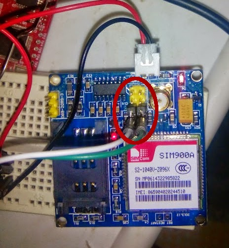
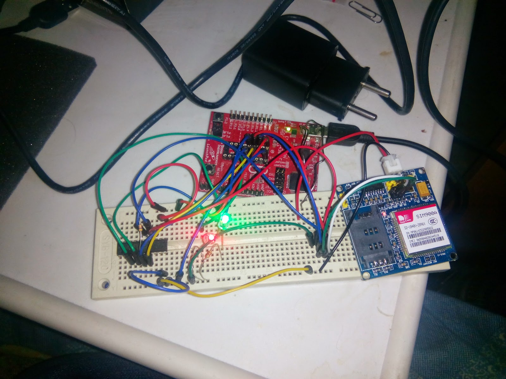

\
Про подводные камни платы SIM900A Mini v3.4 [читать тут](http://antigluk.blogspot.com/2015/01/sim900a-sim900-mini-v34-board.html){.markup--anchor .markup--p-anchor data-href="http://antigluk.blogspot.com/2015/01/sim900a-sim900-mini-v34-board.html" rel="nofollow" target="_blank"}\
\
Схема подключения UART простая: RX в TX, TX в RX.\
Питания для SIM900A: для запуска мне хватило питания 3.3V от LaunchPad'a, но это нарушает даташит - необходимо 4V. Тем не менее, все работает.\

[{border="0"}](images/image-01.png){imageanchor="1" style="margin-left: 1em; margin-right: 1em;"}

\
\

[]{#more}\
\

Изначально джамперы находятся в таком положении для преобразования UART через MAX232:

\

[{border="0" height="320" width="253"}](images/image-02.jpg){style="margin-left: 1em; margin-right: 1em;"}

Но нам не нужно подключать плату к COM-порту компьютера, нам нужен непреобразованный UART-сигнал. Поэтому, переключаем джамперы так, чтоб они "висели" на одном пине, а во второе отверстие джампера подключаем кабеля:\

[{border="0" height="320" width="294"}](images/image-03.jpg){style="margin-left: 1em; margin-right: 1em;"}

\
\
На картинке, зеленый кабель - RX, белый - TX.\
\

### Минимальная программа для Energia

Задача минимум - отправлять комманду "AT" пока нам не ответят "OK". Это означает что мы синхронизировались по скорости передачи и можем отправлять более сложные команды.\
\

``` {#code}
int incomingByte = 0;

void setup(){
  Serial.begin(9600);
  pinMode(P1_6, OUTPUT);
  pinMode(P1_7, OUTPUT);
  digitalWrite(P1_6, LOW);
  digitalWrite(P1_7, LOW);
}

int isOK() {
  if (incomingByte == 'O') {
    incomingByte = Serial.read();
    if (incomingByte == 'K') {
      return 1;
    }
  }
  return 0;
}

void loop() {
  boolean ok=false;
  do {
    do {
      digitalWrite(P1_6, HIGH);
      Serial.println("AT");
      digitalWrite(P1_6, LOW);
      delay(500);
    } while (!Serial.available());
    incomingByte = Serial.read();

    // Skip garbage
    while(Serial.available() && incomingByte == 255)
      incomingByte = Serial.read();
    while(Serial.available()) {
      if (isOK())
        ok = true;
      else
        incomingByte = Serial.read();
    }
  } while (!ok);

  while(1);
}
```

\
\

[{border="0" height="480" width="640"}](images/image-04.jpg){style="margin-left: 1em; margin-right: 1em;"}
