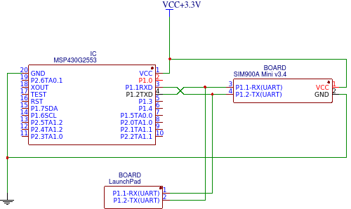
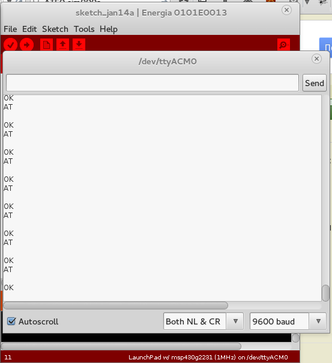

[Подключение MSP430 к SIM900](http://antigluk.blogspot.com/2015/01/msp430-interfacing-to-sim900a.html)\
\
При использовании UART, в целях отладки, мне было необходимо мониторить что посылает msp430 и что отвечает второе устройство (sim900).\
\
Для этого  необходимо вынуть МК из LaunchPad и подключить независимо (например, на breadboard).\
А сам LaunchPad подключить к компьютеру, чтобы мониторить UART.\
\
Схема подключения UART MSP430 -\> Device так, чтоб на компьютере можно было видеть ответы Device:

\
\

[{border="0"} ](images/image-01.png){imageanchor="1" style="margin-left: 1em; margin-right: 1em;"}

\

На компьютере для чтения из UART я пользуюсь Serial Monitor в IDE Energia (подойдет любой другой способ читать из последовательного порта).

\

[{border="0"} ](images/image-02.png){imageanchor="1" style="margin-left: 1em; margin-right: 1em;"}

\
