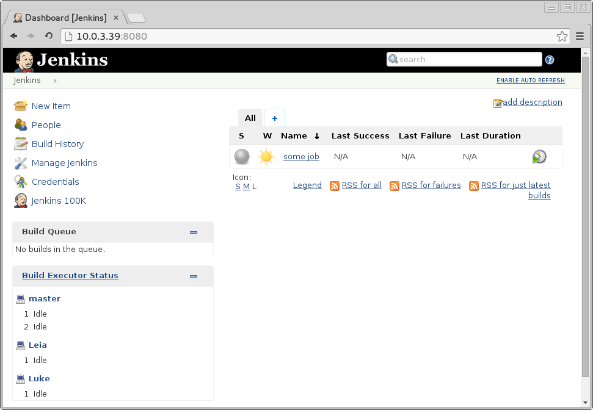

I often need to build some RPM or test my code on different operating systems that have different environment, libraries versions etc. On my host machine I use Arch Linux, but my job requires to write software for RHEL/CentOS. It's useful to use buildbots like Jenkins to run this builds on automated basis, commencing builds after any commit, whatever.\
\
[{border="0" height="276" width="400"}](images/image-01.png){imageanchor="1" style="clear: right; float: right; margin-bottom: 1em; margin-left: 1em;"}Anyway, installing jenkins on host machine and using Docker as slaves is useful, but can clog your computer with garbage files that hard to cleanup. [DJS2](https://github.com/rrader/docker-jenkins-slave) offers you isolated environment (LXC container) where your Jenkins and all Docker slaves are executed, and only jenkins data folder with jobs is stored on your computer.\
\
So, if you need to test/build your code on different linux-based operating systems, all you need with DJS2 is only LXC-enabled Linux host machine and Vagrant.\
\
You can get it here: <https://github.com/rrader/docker-jenkins-slave>\
\
New version of DJS is already on GitHub. It's in beta and still not tested well, but is working on my PC. Try it on your PC and send me feedback, I'd be really pleased to see any feedback - about failures and successful runs as well.\
\
[{border="0" height="207" width="320"}](images/image-02.jpg){imageanchor="1" style="clear: left; float: left; margin-bottom: 1em; margin-right: 1em;"}It's really easy to deploy vagrant with different OS slaves on your local machine. Now CentOS 6 and CentOS 7 only available to use, but eventually all supported OSs will be migrated (as CentOS 5, Suse, Debian).\
\
Pull-Requests are highly appreciated :)\
\
Following text is part of README, it's instructions how to get Jenkins+Docker+LXC on your computer working.\
\

### Prerequisites

\

1.  Vagrant

Optional (but is really recommended)\

1.  vagrant-lxc plugin: `vagrant plugin install vagrant-lxc`
2.  vagrant-lxc related configuration on Host. See <https://github.com/fgrehm/vagrant-lxc/wiki> 

\

### Getting started

> $ git clone git@github.com:rrader/docker-jenkins-slave.git djs
>     $ cd djs
>     $ ./djs.sh up
>     [lots of vagrant output ....]
>     ==================================================
>     Jenkins should be available on 10.0.3.74:8080
>     Start using slaves with adding one
>      e.g. # ./djs.sh add centos7-java Luke

Now you should be able to use your just deployed jenkins on [http://10.0.3.74:8080](http://10.0.3.74:8080/) or similar\
Now let's add some slaves with `./djs.sh add <image> <name>`\

> $ ./djs.sh add centos7-java Luke
>     Unable to find image 'antigluk/jenkins-slave-centos6-java' locally
>     Pulling repository antigluk/jenkins-slave-centos6-java
>     [lots of docker output ....]
>     Status: Downloaded newer image for\
>         antigluk/jenkins-slave-centos6-java:latest\
>         507e2a18674253d0d7d1f5201ee963681704c2d18310af619f9fcbb0124efaf3
>     Connection to 10.0.3.74 closed.

This will pull centos7-java image from Docker Hub and start it. After this command ends you should be able to see Luke worker in "Build Executor Status" section on Jenkins.\
\
\

# 

### Notes \[important\]

Only centos6-java and centos7-java are ready to use now with Vagrant Jenkins\
\
\

### Links

DJS Repository: <https://github.com/rrader/docker-jenkins-slave>\
\
