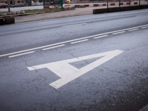
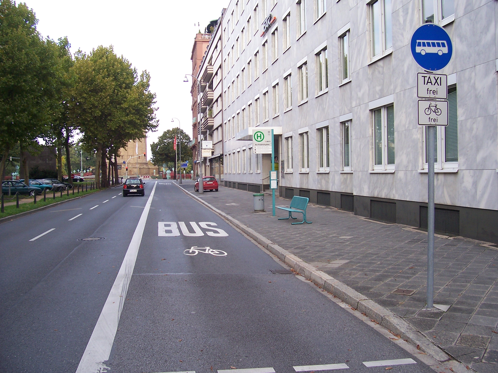
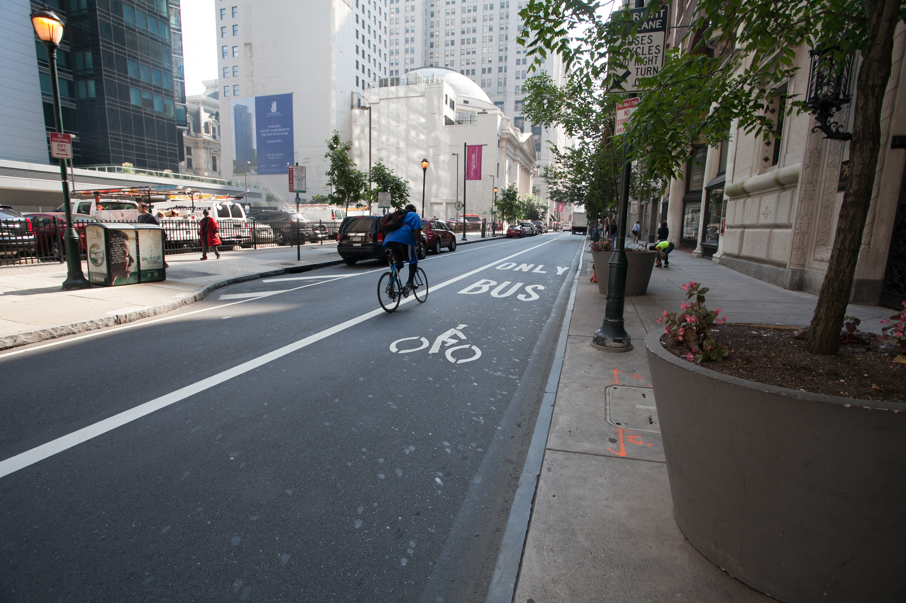

Хочется обратить внимание на проблему велосипеда и полос для общественного транспорта в Киеве. Ввели их не так давно, например полоса на Московском мосту официально работает с ноября 2014.\
 \

  ------------------------------------------------------------------------------------------------------------------------------------------------------
   [{border="0" height="300" width="400"}](images/image-01.jpg){imageanchor="1" style="margin-left: auto; margin-right: auto;"}
                                                 Московский мост, [источник](http://24daily.net/?p=65743)
  ------------------------------------------------------------------------------------------------------------------------------------------------------

Правила запрещают велосипедистам ехать по ним, поэтому крайняя правая полоса, по которой можно ехать велосипедистам, будет второй. Ехать между автобусами и автомобилями/грузовиками очень опасно, не все участники соблюдают интервал. Особенно опасно на мостах, где полосы достаточно узкие, а движение интенсивное.\
\

  ------------------------------------------------------------------------------------------------------------------------------------------------------------------------------------------------
   [{border="0" height="268" width="400"}](http://img.112.ua/original/2015/02/04/122939.jpg){style="margin-left: auto; margin-right: auto;"}
                                                   улица 50-летия Победы в Виннице, [источник](http://www.myvin.com.ua/ru/news/events/16250.html)
  ------------------------------------------------------------------------------------------------------------------------------------------------------------------------------------------------

Проблему можно было бы решить, разрешив велосипедистам ездить по этим полосам. Например, в Великобритании большинство полос для транспорта совмещены с велодорожками установленными знаками, это даже прописано в правилах: <https://www.gov.uk/rules-for-cyclists-59-to-82/overview-59-to-71> (правило 65):\
\

> **65. Bus Lanes.** Most bus lanes may be used by cyclists as indicated on signs. Watch out for people getting on or off a bus. Be very careful when overtaking a bus or leaving a bus lane as you will be entering a busier traffic flow. Do not pass between the kerb and a bus when it is at a stop.

  --------------------------------------------------------------------------------------------------------------------------------------------------------------------------------------------------------------------------------------
   [{border="0" height="266" width="400"}](http://www.eltis.org/sites/eltis/files/photo/london-143.jpg){imageanchor="1" style="margin-left: auto; margin-right: auto;"}
                                                                   London, [источник](http://www.eltis.org/resources/photos/priority-lanes-bus-taxi-and-bicycle-london)
  --------------------------------------------------------------------------------------------------------------------------------------------------------------------------------------------------------------------------------------

\
В Германии также совмещают вело- и транспортные полосы.\

  ------------------------------------------------------------------------------------------------------------------------------------------------------
   [{border="0" height="300" width="400"}](images/image-04.jpg){imageanchor="1" style="margin-left: auto; margin-right: auto;"}
                                   Mannheim, Germany ([источник](https://en.wikipedia.org/wiki/Cycling_infrastructure))
  ------------------------------------------------------------------------------------------------------------------------------------------------------

\
[Есть и в США](http://bicyclecoalition.org/signs_symbols/busbike-lane/), хоть и не распространено широко\

  ------------------------------------------------------------------------------------------------------------------------------------------------------
   [{border="0" height="266" width="400"}](images/image-05.jpg){imageanchor="1" style="margin-left: auto; margin-right: auto;"}
                                                 Chestnut and Walnut Streets in Center City Philadelphia
  ------------------------------------------------------------------------------------------------------------------------------------------------------

\
\
\
Есть [презентация студентов Южной-Флоридского университета](http://planfortransit.com/wp-content/Shared-Bicycle-and-Bus-Lanes.pdf) которая показывает как могут взаимодействовать велосипедисты и транспорт на одной полосе.\
\
Я считаю, если сделать такие совмещенные полосы как минимум на Московском мосту, можно было бы в разы уменьшить опасность переезда на другой берег, при чем не нарушая правила - ведь сейчас нет другого варианта: или ехать по полосе для транспорта, или по тротуару. Оба варианта незаконны.\
А соблюдение правил может закончиться плачевно.\
\
\
Обсуждалось тут:\
<https://www.facebook.com/groups/ukrvelo/permalink/421266208059471/>
