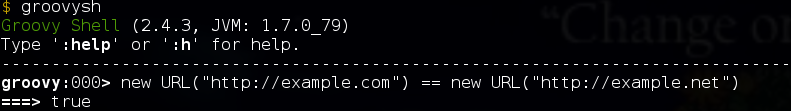

Просто два факта.\

[{border="0" height="400" width="318"}](images/image-01.jpg){imageanchor="1" style="margin-left: 1em; margin-right: 1em;"}

\
1) У объектов java.net.URL методы hashCode и equals [делают DNS Resolve](http://grepcode.com/file/repository.grepcode.com/java/root/jdk/openjdk/6-b14/java/net/URLStreamHandler.java#345) хостнейма указанного в адресе и (sic!) сравнивают два адреса используя их айпи адреса.\
Таким образом,\
\
Из-за DNS-балансировщика new URL("http://google.com") **!=** new URL("http://google.com")  //в разное время,\
\
Два сайта на одном айпи new URL("http://example.com") **==** new URL("http://example.net") \
\

[{border="0"}](images/image-02.png){imageanchor="1" style="margin-left: 1em; margin-right: 1em;"}

\
\
И самое смешное. В HashMap однажды добавленное значение по ключу URL(google.com) может быть никогда не получено, так как хешкод меняется. Особенно заметно когда URL сериализуется и отправляется на другой узел, тогда никакой dns-кеш на любом уровне не сработает и все весело упадет.\
\
\
\
2) Enum.hashCode() в джаве возвращает адрес в памяти. Те же приколы с сериализацией или даже запуском одного и того же кода в разных джава-машинах.\
\
Делая шардинг мапы на java, выбор ноды для хранения/поиска данных по хеш-коду, например.. веселого дебага.
