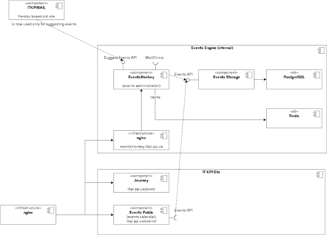

*Ключевые слова: контейнеры, микросервисы, Docker (на самом деле нет).*\
В статье будет рассмотрено\

1.  Что это?
2.  Зачем это?
3.  Немного о микросервисах
4.  Зачем это нам в ІТ КПІ?

\

### 1. Что это?

*Если вы знакомы с идеей контейнеров, можете сразу переходить ко второму разделу*\

> В контейнере можно запускать как один процесс, так и полноценную отдельную операционную систему, запуская процесс `init`.

Контейнеризация — это совокупность механизмов операционной системы, которые позволяют запускать некоторые процессы в изолированной среде. В ядре linux реализованы такие виды изоляции \[1\]:\

- Межпроцессового взаимодействия (IPC),
- Сетевые области видимости (NET),
- Области видимости точек монтирования (MNT),
- Идентификаторов процессов (PID),
- Пользователей (USER),
- Идентификации системы (имя хоста) (UTS).

На примере PID namespaces, это означает что первый процесс, запущеный внутри независимой области видимости от основной, будет иметь номер 1, хотя в родительской области видимости такой процесс уже есть.\
\
Аналогично остальных случаях, процесс в контейнере будет иметь независимый от основной системы список сетевых интерфейсов, точек монтирования и так далее.\
\
Эти механизмы можно применять одновременно или по отдельности, в зависимости от задач. В контейнере можно запускать как один процесс, так и полноценную отдельную операционную систему, запуская процесс `init` (с оговоркой, что «гостевая» система будет использовать то же ядро, что и «хостовая») — так делает LXC, например — это одна из первых утилит контейнеризации, которые появились в линуксе 7 лет назад, в 2008 году.\
\
Самым популярным и модным решением контейнеризации сейчас является Docker, маркетинг которого настолько мощен что многие ассоциируют контейнеризацию с ним. Сразу оговорюсь, что в ІТ КПИ мы его не используем, так как нашли для себя более удобные и эффективные способы доставки и сборки, о которых поговорим ниже.\
\

### 2. Зачем это?

> Основное преимущество изолирования процесса — возможность композиции различных сервисов без неожиданных последствий.

До недавнего времени контейнеры в основном рассматривали как легковесную замену виртуальным машинам — проекты LXC, OpenVZ этому подтверждение. Такая виртуализация не требует поддержки на уровне процессора, при этом потери производительности намного ниже за счет отсутствия необходимости в трате ресурсов на виртуализацию, ведь процессы запускаются в той же операционной системе. Тем не менее, необходимость запускать все системные процессы в гостевой ОС остается, что отражается на производительности.\
\
Последние несколько лет начали практиковать другой способ использования контейнеров: вместо запуска процесса init который тянет за собой запуск всех системных сервисов, запускается лишь целевой процесс. Таким образом мы достигаем нужного уровня изоляции процесса абсолютно без оверхеда по полному запуску гостевой операционной системы. Последний год контейнеры стали настолько популярными, что такой подход даже не причисляют к хипстерству :) Именно таким образом работает [Docker](https://www.docker.com/what-docker){rel="nofollow" target="_blank"}.\
\
*Основное преимущество* изолирования процесса — возможность композиции различных сервисов без неожиданных последствий. Какие могут быть последствия — самый частый пример это использование разных версий библиотек которые идут зависимостями, или в переменных среды, разных операционных системах на компьютере разработчика и сервере, может на компьютере разработчика команда `python` запускает `python2.7`, но на сервере — `python3.5`? Все эти вещи не являются проблемой если разработчик запускает программу в абсолютно той же среде, в которой она будет работать на сервере (возможно с несколько другими настройками, но это уже управляемо).\
\
*Второе преимущество* — управление сервисами. Контейнер, в отличии от пакетов системы, не «размазывается» по файловой системе, нет опасности что некоторые файлы пересекутся между сервисами, может быть легко перенесен на другой узел. При удалении контейнера не остается артефактов. Можно при необходимости запустить несколько копий сервиса.\
\
*Третье* — моё любимое. С контейнерами основная система не засоряется, поэтому можно быть уверенным, что поведение системы всегда ожидаемо и такое как у свежеустановленной ОС.\
\

### 3. Немного о микросервисах

Если говорить о контейнерах, то часто их использование тесно связано с понятием микросервисов, хотя и не обязательно одно подразумевает другое. Микросервисная архитектура очень хорошо накладывается на контейнеры, сервис, помещенный в контейнер, позволяет производить масштабирование какого-либо микросервиса или воркера довольно легко, ведь достаточно скопировать контейнер и запустить на другой ноде.\
Отсутствие необходимости тестировать как разные сервисы ведут себя вместе на одной ноде, ведь они изолированы позволяет автоматизировать и абстрагировать масштабирование и контейнеризацию до уровня PaaS (Platform as a Service) — как [Mesos](http://mesos.apache.org/){rel="nofollow" target="_blank"}, [Kubernetes](http://kubernetes.io/){rel="nofollow" target="_blank"}, [Heroku](http://heroku.com/){rel="nofollow" target="_blank"}, и так далее. Им нет необходимости знать что за приложение вы запускаете, какие библиотеки используете для того чтоб масштабировать и управлять кластером ваших сервисов \[2\].\
\
К недостаткам можно отнести усложнение инфраструктуры для сборки контейнеров и доставки их на сервер.\
\

### 4. Зачем это нам в ІТ КПІ?

Во-первых, потому что это весело :)\
Этот [блог](http://itkpi.pp.ua/){rel="nofollow"} — лишь один видимый сервис из тех что мы используем чтоб вы могли читать статьи, получать [дайджесты событий](https://goo.gl/MmXgXo){rel="nofollow" target="_blank"} каждую неделю на свою почту а также [просматривать их на сайте](http://itkpi.pp.ua/events/){rel="nofollow"}.\
Чтоб приблизительно показать архитектуру наших сервисов, можете посмотреть на диаграмму:\
\

[{border="0" height="459" width="640"}](https://blogger.googleusercontent.com/img/b/R29vZ2xl/AVvXsEizGZ4Rvq4Xkws8XJ5wewm2_UDi47zibzVOTTHegy-dWAZ2ra4F976c7W18tpemmxZNQtqtgDReJ9hSuGUhYis3jMjbA_6VZ2uwhFinRXTG07g6EKuE_K-AyGgzFyyX7R0aO_XYT8RcM9U/s1600/1454836069_ad080454385d4fb4895e55f0129bfff2.png){imageanchor="1" style="margin-left: 1em; margin-right: 1em;"}

\
\
Как видите, только два сервиса — [блог](http://itkpi.pp.ua/){rel="nofollow"} и [календарь событий](http://itkpi.pp.ua/events/){rel="nofollow"}, видно вам, нашим пользователям, остальные являются внутренними для управления базой событий и создания дайджестов.\
\
Собственно, нам важны все преимущества описаные выше кроме масштабирования, потому что этот момент сейчас нам не нужен. Тем не менее, когда придет время мы сможем смасштабировать систему без проблем, что приятно осознавать.\
\
Наш способ деплоя вдохновлен тем как это делают в prom.ua. Мы не используеим lithos \[3\], собираем через Travis CI, ну и в целом способ изменен в сторону упрощения и с поправкой на то, что мы собираем open-source проекты и используем бесплатные тарифные планы у сервисов как github и travis. Рекомендую ознакомиться со статьей [Паши Коломийца](http://engineering.up.technology/author/paul/){rel="nofollow" target="_blank"} — [Rust и контейнеры в продакшене](http://engineering.up.technology/2016/01/29/rust-i-kontieiniery-v-prodakshienie/){rel="nofollow" target="_blank"} чтоб понять как это делается для крупного проекта.\
\
Статья в основном получилась теоретической, дальше уделим внимание подробнее на то как использовать контейнеры и как конкретно мы их используем на сайте. Пока что скажу только что для этого используется:\

- [Vagga](http://vagga.readthedocs.org/){rel="nofollow" target="_blank"} — для запуске сервисов на стороне разработчика, отладки, а также для сборки контейнеров,
- [systemd-nspawn](http://www.freedesktop.org/software/systemd/man/systemd-nspawn.html){rel="nofollow" target="_blank"} — используется для запуска контейнера на сервере,
- [Ansible](http://www.ansible.com/){rel="nofollow" target="_blank"} — скрипты развертывания сервисов на сервере,
- Также используем [Travis CI](http://travis-ci.org/){rel="nofollow" target="_blank"} для сборки контейнеров.

Спасибо за то что дочитали до этого момента, надеюсь дальше разговор будет более предметный.\
\[1\] Man: Linux namespaces — [http://man7.org/linux/man-pages/man7/namespaces.7.html](http://man7.org/linux/man-pages/man7/namespaces.7.html){rel="nofollow" target="_blank"}\
\[2\] Heroku: Dynos and the Dyno Manager — [https://devcenter.heroku.com/articles/dynos#isolation-and-security](https://devcenter.heroku.com/articles/dynos#isolation-and-security){rel="nofollow" target="_blank"}\
\[3\] Rust и контейнеры в продакшене — [http://engineering.up.technology/2016/01/29/rust-i-kontieiniery-v-prodakshienie/](http://engineering.up.technology/2016/01/29/rust-i-kontieiniery-v-prodakshienie/){rel="nofollow" target="_blank"}\
\
\
*Пост изначально написан для [блога ІТ КПІ](http://itkpi.pp.ua/containerization-is-good/).*
